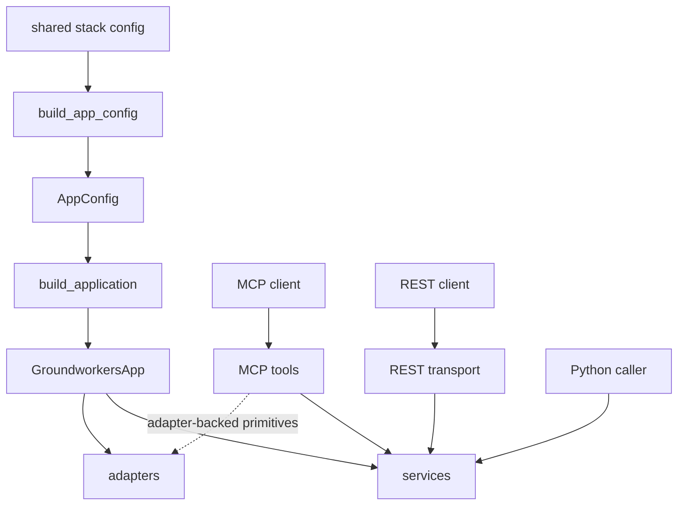

# groundworkers

`groundworkers` is the reusable capability layer for OMOP-grounded lookup, mapping, source planning, and knowledge-pack discovery.

It is available through three interfaces:

- as an **MCP service** for discoverable tool clients
- as a **REST service** for fixed workflow applications
- as a **direct Python library** for in-process applications

No patient-level writes. No session state. No transport-specific business logic.

## What it provides

- OMOP concept lookup and hierarchy navigation
- exact, normalized, full-text, and embedding-backed retrieval
- mapping-oriented candidate bundles and context assembly
- stateless source-planning workflows
- bundled baseline knowledge packs for reusable mapping and planning context
- LLM-backed text normalization and domain classification

## Knowledge packs

`groundworkers` ships with bundled baseline knowledge packs inside the package. These packs are available by default and provide reusable guidance and rules that apply broadly across deployments.

Site-specific or localisation packs are added through the shared stack config via `tools.groundworkers.knowledge_packs_root`. When a configured pack has the same `layer` and `name` as a bundled baseline pack, the configured copy wins.

## Runtime model



`build_application(...)` is the composition root. It builds one reusable runtime container with transport-agnostic services plus dependency-facing adapters. Most caller-facing workflows go through services; some MCP tools are intentionally adapter-backed when the capability is closer to a backend primitive than a domain service.

## Quick start

### Install

```bash
pip install groundworkers
```

Optional extras:

```bash
pip install "groundworkers[tui,embedding-pgvector]"
```

### Configure the shared stack

```bash
omop-config configure omop_alchemy
omop-config configure omop_graph
omop-config configure groundworkers
# optional if you want embedding-backed capabilities
omop-config configure omop_emb
```

### Start MCP

```bash
groundworkers --describe
groundworkers --transport streamable-http --host 0.0.0.0 --port 8000
```

### Start REST

```bash
groundworkers --transport rest --host 0.0.0.0 --port 8080
```

### Use from Python

```python
from groundworkers.app import build_application
from groundworkers.bootstrap import build_app_config

config = build_app_config()
app = build_application(config)

mapping = app.services.mapping
bundle = mapping.concept_candidate_bundle(
    "type 2 diabetes",
    domain="Condition",
    include_normalized=True,
    include_fulltext=True,
    include_embedding=True,
)
```

## Main surfaces

| Surface | Best for |
|---|---|
| MCP tools | Discoverable tools and shared remote capabilities |
| REST routes | Typed HTTP workflows such as candidate bundles and assisted source planning |
| `app.services.*` | In-process Python applications and batch workflows |
| `app.adapters.*` | Backend wrappers used when you intentionally need dependency-shaped primitives |

## Learn more

- Docs home: `docs/index.md`
- Configuration: `docs/usage/configuration.md`
- Integrations: `docs/usage/integrations.md`
- Architecture: `docs/architecture.md`

## Companion repos

- [groundcrew](https://github.com/AustralianCancerDataNetwork/groundcrew)
- [omop-graph](https://australiancancerdatanetwork.github.io/omop-graph/)
- [omop-emb](https://australiancancerdatanetwork.github.io/omop-emb/)
