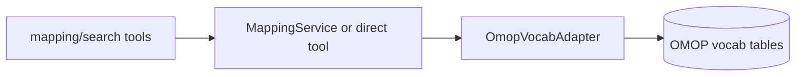

# OmopVocab Adapter

`OmopVocabAdapter` is the vocabulary-focused adapter used for lexical search and
mapping-oriented navigation. It shares the OMOP database engine with
`OmopGraphAdapter`, but has a narrower responsibility: deterministic vocabulary table
queries rather than graph-style traversal.

## Why it matters

This adapter is the main dependency behind:

- `concept_search_exact`
- `concept_search_fulltext`
- `concept_navigate_to_standard`
- `concept_search_normalized`
- `concept_candidate_bundle`
- `concept_map_to_value`

It is also the core adapter that `MappingService` builds on.

## Key responsibilities

| Capability | Example methods |
|---|---|
| Exact lexical search | `search_exact(...)` |
| Ranked full-text retrieval | `search_fulltext(...)` |
| Deterministic normalization search | `search_normalized(...)` |
| Standard mapping navigation | `navigate_to_standard(...)` |
| "Maps to value" navigation | `navigate_to_value(...)` |

## Role in the layered design

The important boundary is that `OmopVocabAdapter` should stay dependency-shaped. It
does not own multi-channel orchestration or mapping-review policy; that belongs in
`MappingService`.
