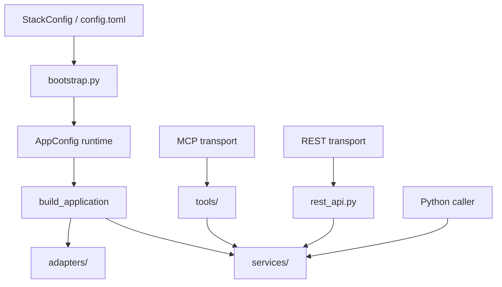
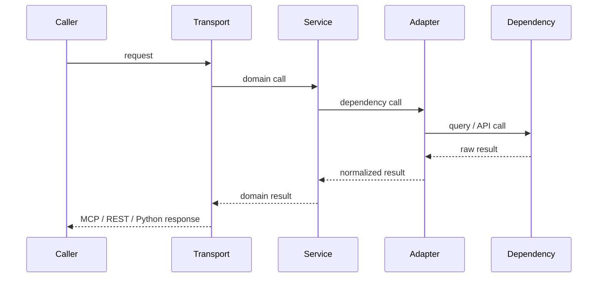

# Architecture

`groundworkers` is organised so that configuration, domain logic, and transport
concerns stay separate. That separation matters both for users choosing an
integration style and for contributors adding new capabilities.

## Runtime layers

## What each layer owns

### Shared stack configuration

The source of truth is the shared OMOP stack configuration loaded through
`oa-configurator`.

- `omop-alchemy` owns the shared CDM resource
- `omop-graph` owns graph-specific package settings
- `omop-emb` owns embedding-store and embedding-model settings
- `groundworkers` owns transport defaults, LLM-backed worker behavior,
  source-planning settings, and knowledge-pack settings

`groundworkers` does not maintain a second YAML-era runtime model.

### `bootstrap.py`

`bootstrap.py` resolves the active stack config into the runtime `AppConfig`.
That includes:

- selecting the active stack file and profile
- resolving the shared CDM resource and engine
- loading sibling package config (`omop_graph`, `omop_emb`)
- loading `groundworkers` package-owned settings
- resolving optional knowledge-pack roots

If you need to change how configuration is resolved, this is the layer to edit.

### `app.py`

`build_application(config)` is the composition root. It constructs:

- adapters from already-resolved concrete handles
- services from those adapters
- a `GroundworkersApp` container that transports can reuse

This keeps the rest of the codebase free of config-file and profile-selection
knowledge.

### `adapters/`

Adapters are dependency-facing wrappers. Each adapter should wrap one external
system cleanly:

- `CDMAdapter` wraps the SQLAlchemy engine/session factory
- `OmopGraphAdapter` wraps the omop-graph backend runtime
- `OmopEmbAdapter` wraps omop-emb index and query behavior
- `LLMAdapter` wraps the configured model backend

Adapters are intentionally config-agnostic. They should accept already-built
handles or explicit constructor values, not TOML sections or loader logic.

### `services/`

Services contain reusable domain logic that should work the same regardless of
transport:

- `VocabService` for lexical retrieval and OMOP navigation
- `GraphService` for deterministic graph-backed lookup, traversal, paths, and neighborhood exploration
- `ConceptGroundingService` for caller-facing grounding policy over the graph service
- `MappingService` for multi-channel candidate and context workflows
- `TextService` for LLM-backed text preprocessing
- `DomainService` for LLM-backed structured-field domain hints
- `SourcePlanningService` for stateless source-planning pipelines

If the logic is something a Python caller would reasonably want without going
through MCP, it probably belongs in a service.

### Transport layers

`groundworkers` currently exposes two transport styles over the same service
layer:

- **MCP** via the tool modules in `tools/`
- **REST** via `rest_api.py`

The transport layers should stay thin:

1. validate or clamp request inputs
2. call a service
3. call an adapter directly only for intentionally adapter-shaped primitives that do not have a service abstraction
4. translate exceptions into transport-appropriate error responses

Business logic should not exist only in MCP wrappers or only in REST routes.

## Which layer should a caller use?

| Need | Call |
|---|---|
| Tool discovery, agent interoperability, remote service | MCP tools |
| Fixed HTTP workflow endpoints | REST API |
| Domain workflows from Python | `app.services.*` |
| Backend-shaped primitives for a specific dependency | `app.adapters.*` |

## Request flow

## Design rules for contributors

- Put resource and profile resolution in `bootstrap.py`, not in adapters.
- Keep adapters dependency-shaped and reusable.
- Keep services transport-agnostic.
- Add MCP tools only when the capability should participate in tool discovery.
- Add REST endpoints only for curated workflow operations, not every internal method.

The extension guide in [Extending groundworkers](development/extending.md)
spells out the expected shape for new adapters, services, MCP tools, and REST
routes.
