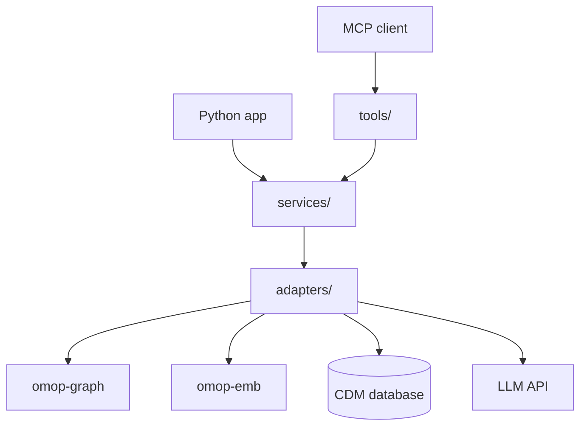
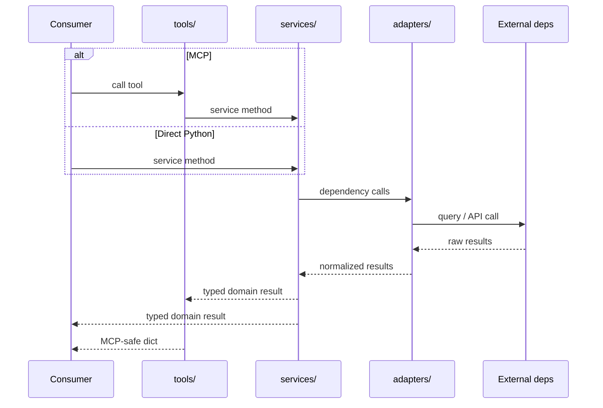
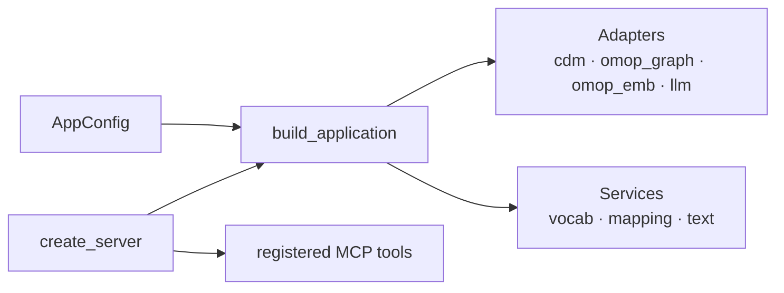

# Architecture

This page answers one practical question:

**If you want to use `groundworkers`, which layer should you call?**

## The short answer

- Use **MCP tools** when you want a remote tool interface.
- Use **`app.services.*`** when you want domain operations directly from Python.
- Use **`app.adapters.*`** when you need exact control over a specific integration.

## Layers

## What each layer is for

### `adapters/`

Adapters are thin wrappers over external dependencies. Each adapter handles exactly
one dependency:

- `CDMAdapter` — holds the SQLAlchemy engine and session factory for a CDM database
  connection. Shared by `VocabService` and `OmopGraphAdapter`.
- `OmopGraphAdapter` — wraps the omop-graph `KnowledgeGraph`; owns concept traversal,
  grounding, and path-finding.
- `OmopEmbAdapter` — wraps the omop-emb `EmbeddingReaderInterface`; owns embedding
  search and index access.
- `LLMAdapter` — wraps an OpenAI-compatible chat completion API; owns structured
  and unstructured model calls.

Adapters are config-agnostic. They receive already-constructed handles (Engine,
reader, API client) rather than config objects. Only `build_application()` reads
config and constructs those handles.

### `services/`

Services contain domain logic that is useful to Python callers independent of MCP.
A service layer exists when the logic encodes bespoke domain knowledge — multi-source
orchestration, mapping policy, scoring — that a downstream Python application would
want to call directly without going through MCP.

- `VocabService` — vocabulary search and concept navigation over the CDM vocabulary
  tables. Provides `search_exact`, `search_normalized`, `search_fulltext`,
  `navigate_to_standard`, `navigate_to_value`, and `navigate_to_unit`.
- `MappingService` — orchestrates `VocabService`, `OmopGraphAdapter`, and
  `OmopEmbAdapter` to build candidate bundles, resolve mapping expressions, and
  assemble mapping context packets.
- `TextService` — LLM-backed clinical text preprocessing. Provides `normalize`,
  `decompose`, and `disambiguate` via `LLMAdapter`.

Not everything needs a service. `resolver_tools.py` calls omop-graph directly because
it adds nothing the graph library does not already expose. The service layer is not a
mandatory pass-through — it exists only where the logic is worth reusing.

### `tools/`

Tools expose services and adapters over MCP. Each tool does three things:

1. Validate and clamp inputs.
2. Call a service or adapter method.
3. Convert exceptions into MCP-safe error dicts.

If you are building an MCP client, this is the layer you interact with.

### `app.py` and `server.py`

- `build_application(config)` constructs the shared object graph: adapters, then
  services that depend on those adapters.
- `create_server(config)` wraps that graph and registers MCP tools on top of it.

## Which layer to pick

| If you need... | Use... |
|---|---|
| Remote tool calls, agent interoperability | MCP tools |
| Vocabulary search or mapping workflows from Python | `app.services.vocab` or `app.services.mapping` |
| LLM-backed text preprocessing from Python | `app.services.text` |
| Exact control over embedding or graph operations | `app.adapters.omop_emb` or `app.adapters.omop_graph` |

## Request flow

## Composition

## Practical rules

- If the code coordinates multiple data sources or encodes domain policy, put it in
  `services/`.
- If the code mainly wraps a library API or database session, put it in `adapters/`.
- If the code validates inputs and shapes transport responses, put it in `tools/`.
- If a tool adds nothing beyond what the library already exposes, skip the service
  layer and let the tool call the adapter directly.
