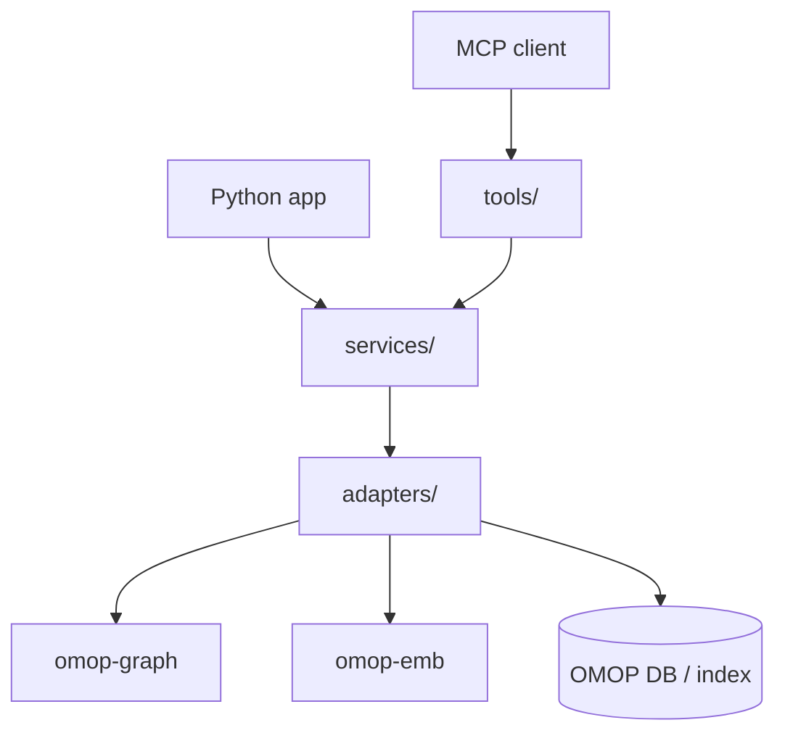
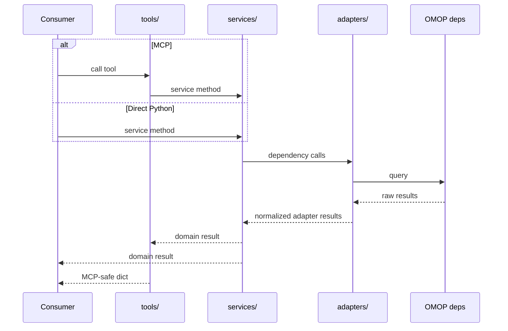
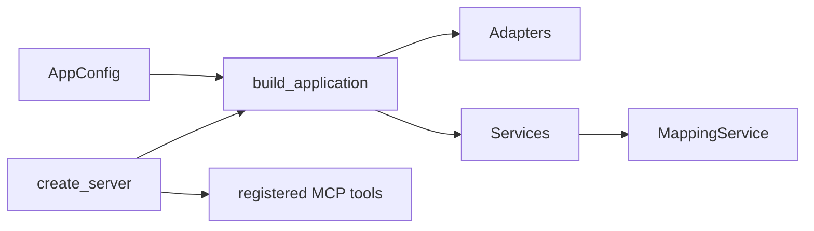

# Architecture

This page is mainly about one practical question:

**If you want to use `groundworkers`, which layer should you call?**

## The short answer

- Use **MCP tools** when you want a remote tool interface.
- Use **`app.services.mapping`** when you want higher-level mapping workflows from Python.
- Use **`app.adapters.*`** when you want lower-level dependency-shaped operations.

## Layers

## What each layer is for

### `adapters/`

Adapters handle dependency-specific work:

- calling `omop-graph`
- calling `omop-emb`
- running vocabulary-table queries
- smoothing over backend-specific behavior

If you need exact control over those integrations, this is the layer to use.

### `services/`

Services handle workflow logic that is useful across applications:

- assembling candidate bundles
- combining lexical, graph, and embedding evidence
- building mapping context packets
- resolving simple mapping expressions
- evaluating predicted mappings against references

If you are building a Python application and want to reuse `groundworkers` logic,
this is the layer you usually want.

### `tools/`

Tools expose the same capabilities over MCP. They mostly do three things:

1. validate and clamp inputs
2. call a service or adapter method
3. return an MCP-friendly result shape

If you are building an MCP client, this is the layer you see.

### `app.py` and `server.py`

- `build_application(config)` creates the shared Python object graph
- `create_server(config)` uses that graph and registers MCP tools on top

## Why the service layer exists

Without a service layer, a Python application has to choose between two awkward
options:

- reimplement the workflow logic itself
- or import MCP tool wrappers that are shaped for transport, not for library use

`services/` gives Python consumers a cleaner place to start.

## Request flow

## Composition

## Which layer should you pick?

| If you need... | Use... |
|---|---|
| Remote tool calls, discovery, or agent interoperability | MCP tools |
| High-level mapping workflows from Python | `app.services.mapping` |
| Exact lower-level OMOP or embedding operations | `app.adapters.*` |

## Practical rule

- If the code coordinates multiple data sources or encodes mapping policy, put it in `services/`.
- If the code mainly deals with dependency APIs or database details, put it in `adapters/`.
- If the code mainly validates inputs and shapes transport responses, put it in `tools/`.
