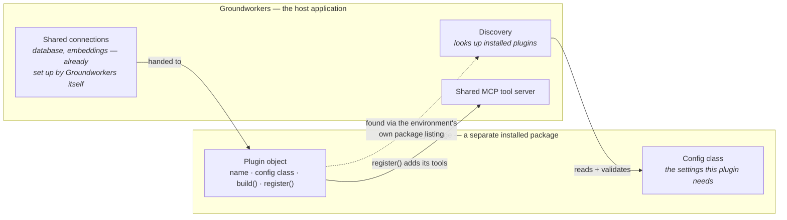
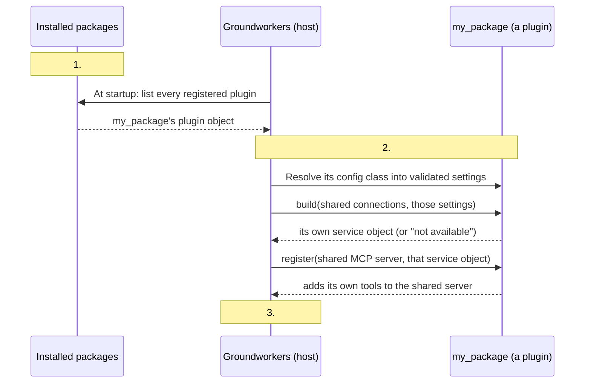

# Plugin architecture

## What a plugin is

Groundworkers plugins are independently installed packages that add an adapter, service, and MCP surface without adding plugin-specific imports to Groundworkers. They register one ready-to-use plugin object under the `groundworkers.plugins` entry-point group.

```toml
[project.entry-points."groundworkers.plugins"]
my_plugin = "my_package.plugin:plugin"
```



The object implements `GroundworkersPlugin`: a stable `name`, an optional `PackageConfigBase` class, `build(context, config)`, and `register(server, state)`. The plugin name and `config_cls.tool_name` must match. **Installed plugin names must be unique.**

```python
class MyPlugin:
    name = "my_plugin"
    config_cls = ExampleConfig  # or None, if this plugin needs no configuration

    def build(self, context, config):
        ...  # return a service object, or None if a prerequisite is unavailable

    def register(self, server, state):
        ...  # add this plugin's MCP tools/resources


plugin = MyPlugin()
```

## Start from the use case

A plugin's configuration should follow from what it needs to be able to complete its task. 

Work through each requirement before writing the class.

For example, a plugin recommending comparator cohorts might reason like this.

**Reuse a resource Groundworkers already resolved.** Nothing to declare — read it straight off `PluginContext` inside `build()`:

| Use case | What you need | How you get it |
|---|---|---|
| Look up existing OMOP concepts | Read access to the CDM vocabulary connection Groundworkers already opened | `context.cdm_engine` / `context.resolver` |
| Rank or filter by similarity to concepts Groundworkers already embedded | The concept embeddings Groundworkers already populated, via omop-emb | `context.vector_store` + `context.embedding_backend_factory` |
| Ask an LLM to help decide something | The chat model Groundworkers already configured, via omop-llm | `context.chat_backend_factory` |

**Create something this plugin owns.** Each becomes a field on its own `PackageConfigBase` — see [Package configuration](#package-configuration):

| Use case | What you need | Configuration field established | Notes | 
|---|---|---|---|
| Store its own distinct non-CDM source tables | A database connection this plugin owns and writes to | `comparator_db: Annotated[str, RefTo(CDMDatabaseConfig)] = "cdm_db"` | Same shape as a core reference, but the operator points it at a new entry when they configure the plugin |
| Vectorised *arbitrary free text or objects* for similarity search | Its own embedding model | `embedding_model_name: Annotated[str \| None, RefTo(ModelConfig)] = None` | Optional, independent of Groundworkers' own model choice |
| Store and search those vectors | Its own vector index | `vector_store_name: Annotated[str \| None, RefTo(VectorStoreConfig)] = None` | **Not existing OMOP concepts, see above** |
| Let operators tune how strict "similar enough" is | Parameter the plugin's logic requires | `min_databases_default: int = Field(default=2, ge=1)` | A plain setting, nothing to resolve |

The concept-embedding row and the free-text-embedding row look similar but are not the same decision: the first reuses a vector store Groundworkers already populated with OMOP concepts; the second stands up an independent embedding model and vector store for data that was never a concept to begin with. Reusing `context.vector_store` for the second case would put unrelated vectors in Groundworkers' own concept index.

### Assumptions this table is making

- **Vocabulary only, so far.** Every example above reads OMOP *vocabulary* i.e. operations over concepts, concept relationships, concept embeddings. Nothing about `context.cdm_engine` restricts a plugin to vocabulary tables specifically, however. These tables are available over the same CDM connection groundworkers itself uses, and a plugin *could* query clinical/person-level tables (`condition_occurrence`, `drug_exposure`, etc.) through it just as easily, subject to whatever environmental and procedural access controls actually govern that data. 
- **Plugin graph access is TODO.** `PluginContext` does not expose graph traversal at this time, which means that a plugin that wants graph traversal would have to depend on `omop-graph` itself and build its own adapter, reusing `context.cdm_engine` for the connection but not groundworkers' own shared instance. Recommend not doing it that way, however, as it would be easier to expose the core graph the same way `vector_store` and `embedding_backend_factory` already are. 

## Build and register a new plugin

`build()` receives `PluginContext`. The context provides the resolved CDM database and engine, vector store, shared lazy model backend factories, and a deliberately narrow resolver for independent named OA resources. Return `None` when a prerequisite is unavailable. Groundworkers then keeps serving its core capabilities and reports why the plugin was not activated.

`register()` adds MCP tools, prompts, or resources against the state returned by `build()`. The shared MCP registration wrapper supplies the same safe error translation used by core tools. Code-defined prompts can continue to derive their arguments from the callable signature. A plugin publishing data-defined prompts can pass explicit string metadata with `PromptArgument`; this keeps dynamic pack fields out of Python closure signatures:

```python
from groundworkers.base import PromptArgument

server.prompt(
    "my_pack_workflow",
    title="Run my pack workflow",
    description="Start the workflow published by my pack.",
    arguments=[
        PromptArgument(
            "request",
            "The user's starting request.",
            required=False,
        )
    ],
)(handler)
```



1. The plugin's own installer registered one entry: "here is my plugin object."
2. Groundworkers' code never imports `my_package` by name. It only expects four things on the object (`name`, optional `PackageConfigBase` class, plus `build` and `register` methods, described above).
3.  The plugin's tools are now callable through the one Groundworkers server.

## Package configuration

A plugin with scalar and `RefTo` fields receives a setup-console page without any Groundskeeping-aware plugin code:

```python
from typing import Annotated, ClassVar

from oa_configurator import CDMDatabaseConfig, PackageConfigBase, RefTo
from pydantic import Field


class ExampleConfig(PackageConfigBase):
    tool_name: ClassVar[str] = "my_plugin"

    database: Annotated[str, RefTo(CDMDatabaseConfig)] = "cdm_db"
    retries: int = Field(default=2, ge=1)
```

The generic workflow maps supported Pydantic scalars to Groundskeeping fields, offers existing references of the correct concrete type, and can create a new reference chain recursively through oa-configurator's public `plan_configure()` API. Candidates remain private to the Groundworkers provider; review output is redacted and persistence is revision-aware.

Schemas requiring live discovery or a conditional flow (and therefore not fitting the default configuration UX specification) may additionally implement the runtime-checkable `GroundworkersPluginConfigUI` protocol. Its `tui_workflow(operation)` method returns a custom `(ConfigWorkflowSpec, ConfigMutationService)` pair. Keep Groundskeeping in the plugin's optional TUI dependencies so headless plugin imports remain lightweight.

### Sensitive fields

`PackageConfigBase` inherits oa-configurator's `SecretSafeModel`. A plugin developer must mark every plugin-owned secret with `Sensitive()` so model representations, interactive fields, configuration views, and review diffs can redact it by schema declaration. Groundworkers does not infer sensitivity from field names.

```python
from typing import Annotated, ClassVar

from oa_configurator import PackageConfigBase, Sensitive
from pydantic import Field


class ExampleConfig(PackageConfigBase):
    tool_name: ClassVar[str] = "my_plugin"
    api_token: Annotated[str | None, Sensitive()] = Field(default=None)
```

The `oa_configurator.Secret` alias is equivalent to `Annotated[str | None, Sensitive()]`. Prefer a `RefTo` field when a plugin can reuse an existing database, model, provider, or vector-store entry. The plugin then stores only the logical reference name; sensitivity remains declared on the referenced schema, such as `ConnectionConfig.password` or `ProviderConfig.api_key`, and the generic recursive configuration workflow preserves those declarations.

This protects display and logging surfaces; it does not encrypt persisted configuration. Plugin documentation must describe the storage expectations for any secret it introduces.

## Setup steps

Plugin data preparation belongs in registered setup steps. A plugin may expose a `setup_steps` tuple of `PluginSetupStep` instances. Each step declares a stable key, operator copy, typed arguments, and a `build_plan(values, config_path)` callable that returns a `MaintenancePlan`.

The host provides the common setup-console form and review flow, passes argument values only to that run, and starts the resulting plan through the durable maintenance-run store. Logs, progress, cancellation, retry, and the Runs view are therefore shared by core operations and plugins.

Setup arguments are separate from package configuration: database/model references and policy defaults belong in configuration, while paths to an input export belong to the one-off setup run.

Long-running plugin work should be represented by commands in the plan and run out of process. The command may invoke the plugin's own setup module or console entry point; Groundworkers does not import plugin internals or reproduce their loading logic.

## Readiness verification

A plugin may implement `GroundworkersPluginReadiness.verify_readiness(state)` when operators need to distinguish valid package configuration from an initialised, usable capability.

Verification is read-only and returns a `PluginReadinessResult` containing a stable state, a summary, and `PluginReadinessField` values. Display values must never contain credentials, connection URLs, or raw exception text.

The contract is headless: it contains no Groundskeeping types. Groundworkers uses the same result for generic setup-console rendering, while a plugin may return `result.as_dict()` from its own MCP status tool. Plugins own dependency- specific checks; the host only builds current plugin state, handles unavailable configuration safely, and maps readiness states to existing Groundskeeping status, table, empty, action, and detail contracts.


## Lifecycle and diagnostics

Groundworkers discovers the plugin set once per application build, validates its identities, resolves each package configuration, and builds state. MCP registration uses those same discovered objects. `groundworkers --describe` lists active plugins and safe `plugin_issues` for plugins skipped because their configuration, prerequisites, build, or registration failed.
