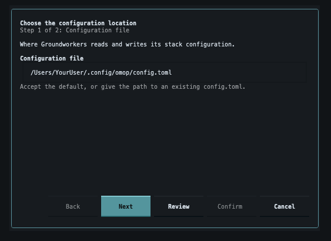
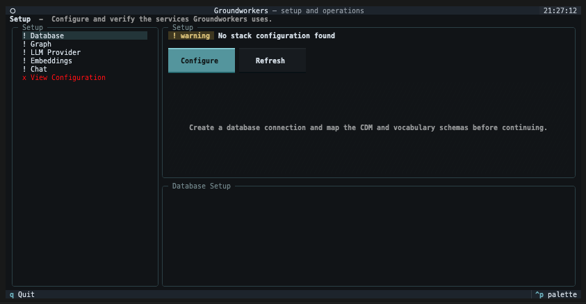
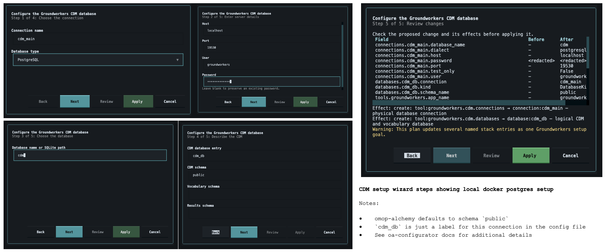
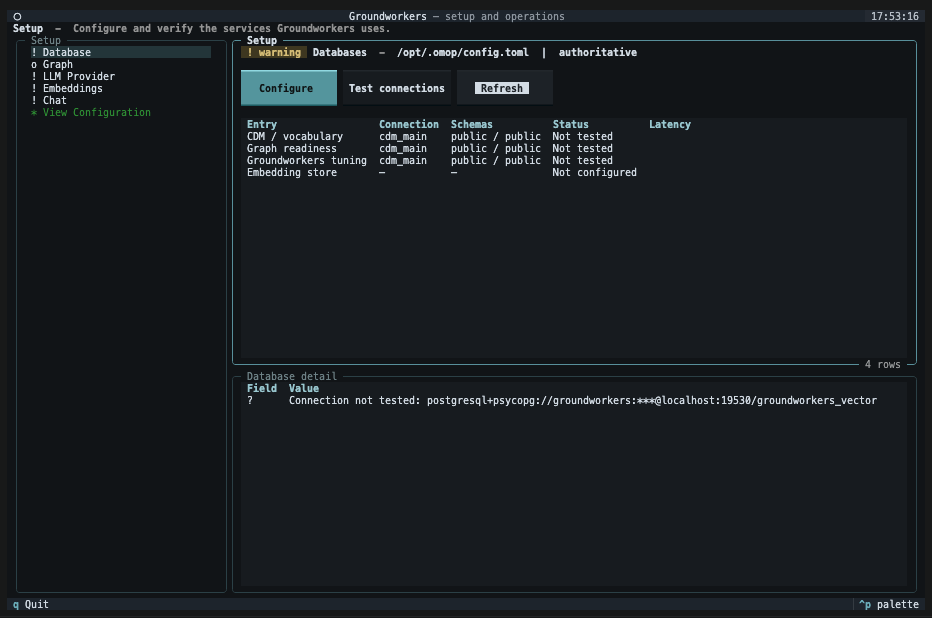
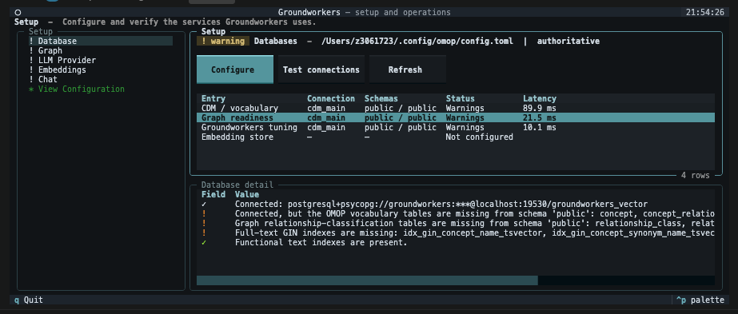
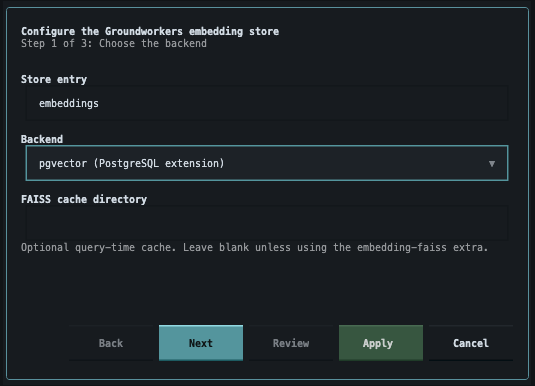
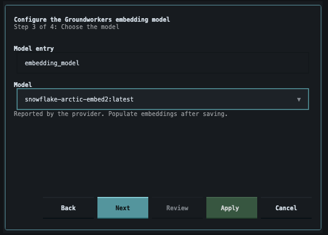
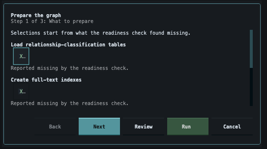
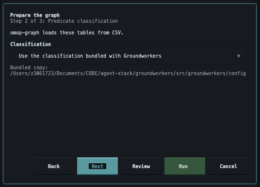
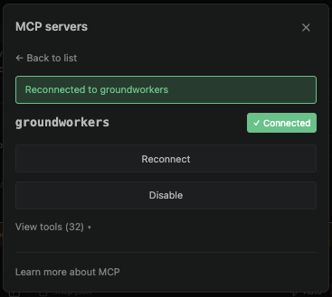

**IMPORTANT NOTE** - groundworkers is in beta state at the moment (as at August 2026). The configuration options below are the ones that have been tested from scratch. Although file based options for database backing and cached embeddings are supproted by their individual libraries, we recommend sticking to pgvector for both at this time.

Similarly, if you choose not to apply the omop-graph optimisations for string indices and clustering, you should expect that graph operations will be slow. These indices take more space than is typical for standard OMOP CDM vocabularies, but they do significantly improve performance.

These instructions cover setup for local use in a python virtual environment, which is useful to run through claude code, or similar. If you want a visual tool inspector, [the bedrock repository](https://github.com/AustralianCancerDataNetwork/bedrock), which offers a containerised version, may also be an option.

### Local Dev Installation

Demonstrated configuration: 

```
uv pip install -e ".[tui,all_source,embedding-pgvector]"
```

### Create Config

If it's your first time starting up, you will need to select a location for your config file.



If your config file is empty, the starting screen will be underwhelming.



Configure your first database. Select one that meets the following pre-requisites:

- OMOP vocabularies loaded
- pg-vector compatible postgres version

Not a requirement (yet):

- pgvector enabled
- any embeddings loaded
- fulltext extension
- index creation optional



Press *Test connections* to validate the setup.




Click through the different rows in the *Setup* pane and you can view different warnings in the *Database detail* pane



Before completing Embedding setup in the left hand menu, you should establish the embeddings vectore-store while still in the initial Database configuration screen.



Once a vector store has been created, you can register a new model.




Select the Graph tab on the left hand side to load the graph relationship predicates and create required text-based indices.





In your development environment (here, vscode), you will need to tell the agent how to find the tools that have been registered...

```json
{
  "mcpServers": {
    "groundworkers": {
      "command": "/Users/[name]/Documents/CODE/agent-stack/groundworkers/.venv/bin/groundworkers",
      "args": [
        "--config-path",
        "/Users/[name]/.config/omop/config.toml"
      ]
    }
  }
}
```

And if that has been done correctly, you should see something like this: 


