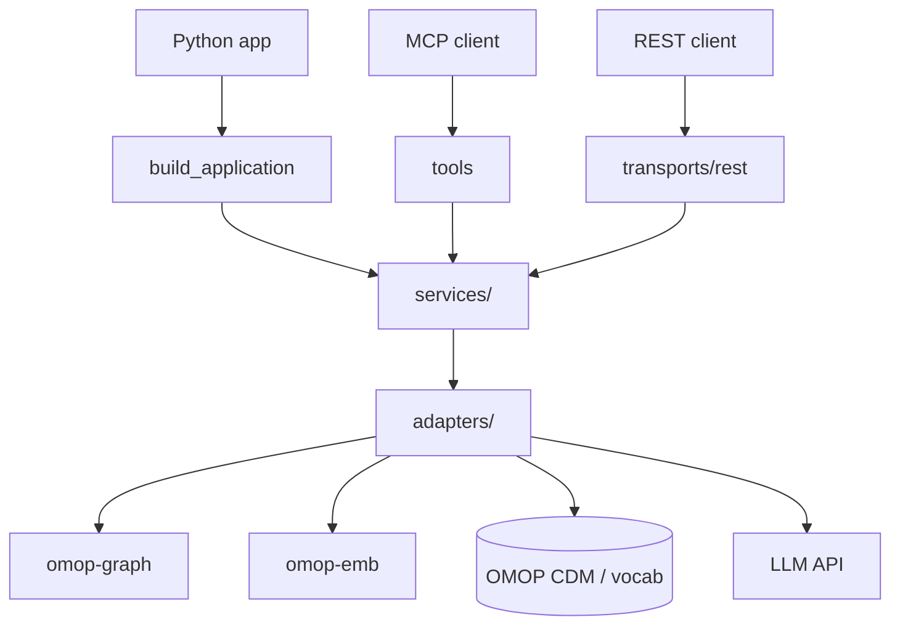

# groundworkers

`groundworkers` is a read-only capability layer for working with OMOP vocabularies, graph relationships, source metadata, and mapping context. It combines deterministic operations with optional embedding and model-assisted steps. It is available through three interfaces:

- as an **MCP service** for discoverable tool clients
- as a **REST service** for controlled workflow applications
- as a **direct Python library** for in-process applications

## Choose the interface that fits your application

| Use case | Recommended interface |
|---|---|
| Discoverable tools or a shared remote service | MCP |
| Fixed request/response workflows, typed HTTP clients, OpenAPI | REST |
| In-process Python applications, batch evaluation, custom orchestration | Direct Python |

## First time setting up locally?

[Try here](from-scratch.md)

## What it helps you do

- retrieve concepts by exact, normalized, full-text, or embedding similarity;
- ground free text with a tiered resolver and inspect how the result was found;
- assemble mapping evidence and graph context for review;
- plan source artifacts before ingestion and discover applicable knowledge packs;
- optionally normalize text, classify structured fields, or project grounded concepts into CDM rows.

Start with [Concepts and capability choices](concepts.md) for the mental model, then choose an integration path.

## At a glance

The transport is thin, reusable workflow logic lives in `services/`, and concrete dependencies are isolated behind `adapters/`. See [Architecture](architecture.md) for configuration and startup wiring.

## Where to start

- [Concepts and capability choices](concepts.md) to understand grounding, mapping, retrieval, and optional infrastructure
- [Installation](usage/installation.md) for package installation and prerequisites
- [Initial local setup](from-scratch.md) for a fresh local deployment
- [Integrations](usage/integrations.md) for MCP, REST, and direct Python usage
- [Configuration](usage/configuration.md) for the shared-stack config model and runtime combinations
- [Tools overview](tools/overview.md) for the discoverable MCP surface

## Relation to groundcrew

`groundworkers` and `groundcrew` are intentionally separate:

- `groundworkers` owns reusable stateless capabilities
- `groundcrew` owns orchestration, session state, and job lifecycle

In the usual deployment, `groundcrew` talks to `groundworkers` over MCP. A Python application can use the same service layer directly through `build_application(...)`.
