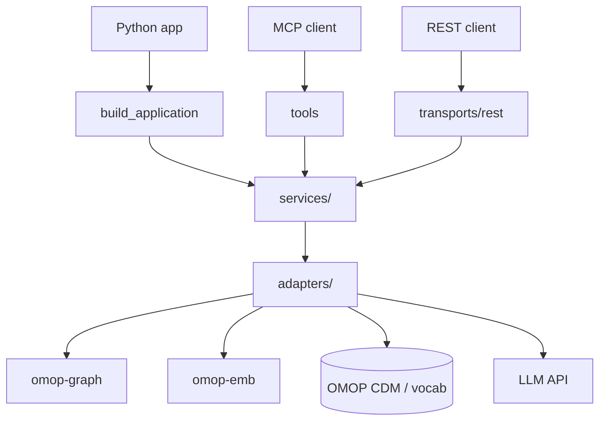

# groundworkers

`groundworkers` is the reusable capability layer for OMOP-grounded lookup, mapping, source planning, and knowledge-pack discovery. It is available through three interfaces:

- as an **MCP service** for discoverable tool clients
- as a **REST service** for controlled workflow applications
- as a **direct Python library** for in-process applications

## Choose the interface that fits your application

| Use case | Recommended interface |
|---|---|
| Discoverable tools or a shared remote service | MCP |
| Fixed request/response workflows, typed HTTP clients, OpenAPI | REST |
| In-process Python applications, batch evaluation, custom orchestration | Direct Python |

## First time setting up locally?

[Try here](from-scratch.md)

## At a glance

The transport is thin, reusable workflow logic lives in `services/`, and concrete dependencies are isolated behind `adapters/`. See [Architecture](architecture.md) for configuration and startup wiring.

## What groundworkers provides

- **Vocabulary and hierarchy lookup** over OMOP concepts
- **Multi-channel mapping workflows** combining exact, normalized, full-text, and embedding retrieval
- **Source planning** for stateless pre-ingest analysis
- **Knowledge-pack discovery** over bundled baseline packs plus optional site or localisation packs
- **LLM-backed text normalization and domain classification**
- **Thin transports** over the same service layer

## Where to start

- [Installation](usage/installation.md) for package install, stack prerequisites, and service startup
- [Configuration](usage/configuration.md) for the shared-stack config model and ownership boundaries
- [Integrations](usage/integrations.md) for MCP, REST, and direct Python usage patterns
- [Architecture](architecture.md) for composition, transport flow, and extension boundaries
- [Extending groundworkers](development/extending.md) for adding adapters, services, MCP tools, or REST endpoints

## Relation to groundcrew

`groundworkers` and `groundcrew` are intentionally separate:

- `groundworkers` owns reusable stateless capabilities
- `groundcrew` owns orchestration, session state, and job lifecycle

In the usual deployment, `groundcrew` talks to `groundworkers` over MCP. A Python
application can use the same service layer directly through `build_application(...)`.
