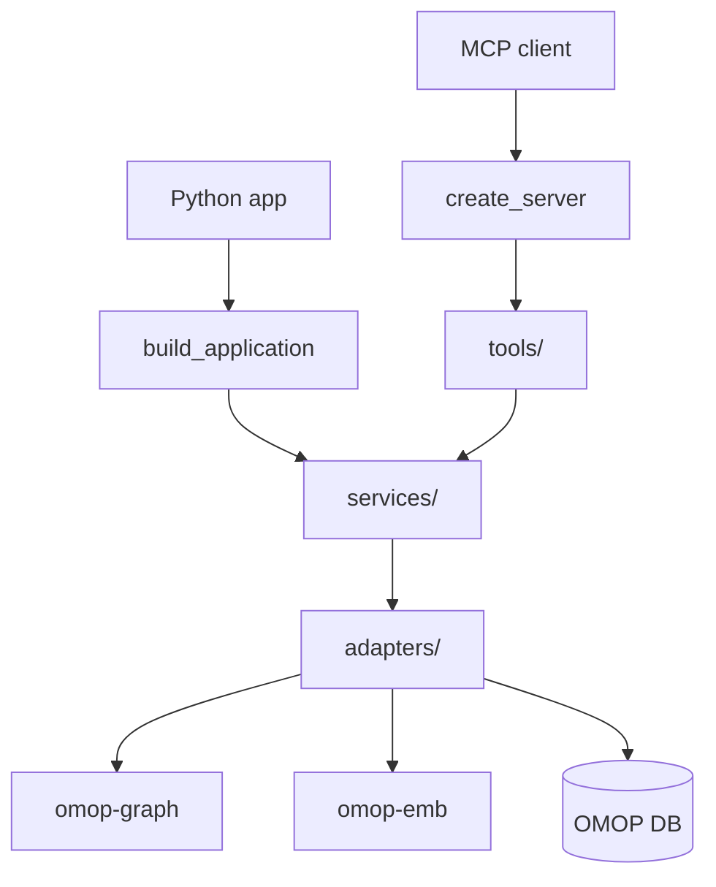

# groundworkers

`groundworkers` gives you read-only OMOP concept and mapping tools that can be used
either over MCP or directly from Python.

## Choose the interface that fits your app

- Use the **MCP server** when you want tool discovery, process isolation, or a shared service for multiple clients.
- Use the **Python library** when you want in-process calls with normal Python return values and exceptions.

## At a glance

## What most users care about

- **Concept and hierarchy lookup** for deterministic OMOP operations
- **Search and grounding** for lexical and semantic retrieval
- **Mapping workflows** for candidate bundles, parent backoff, and context packets
- **Structured domain classification** for data-dictionary-style field sets
- **One configuration model** for both MCP and direct Python use

For direct Python consumers, the main entrypoint is `build_application(config)` and
`app.services.mapping`.

## Where to read next

- [Architecture](architecture.md) for the package structure and layer boundaries
- [Integrations](usage/integrations.md) for end-to-end MCP and Python examples
- [Mapping Tools](tools/mapping.md) for mapping-oriented workflows
- [API Reference](reference/ref_services.md) for the service surface and `build_application`

## Relation to groundcrew

!!! info
    [groundcrew](https://github.com/AustralianCancerDataNetwork/groundcrew) usually
    connects to `groundworkers` over MCP. If you are building a Python application,
    you can also import the same mapping logic directly through `build_application(config)`.
