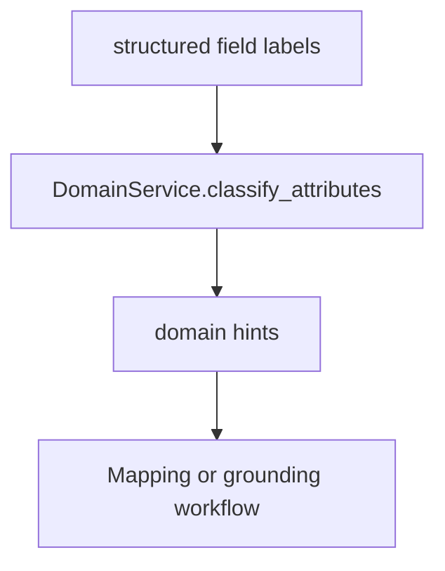

# DomainService

`DomainService` provides LLM-backed batch OMOP domain classification for
structured field labels. It is intended for callers that already have a set of
data-dictionary-style field labels and, optionally, example response values for
each field.

The service returns only confident classifications. Uncertain labels are omitted
so the caller can fall through to its next resolution tier rather than being
forced to accept a weak guess.

## Construction

`DomainService` requires a configured `LLMAdapter`. It is constructed
automatically by `build_application()` when `llm` is configured.

```python
from groundworkers.app import build_application
from groundworkers.config import AppConfig

config = AppConfig.load("config/groundworkers.local.yaml")
app = build_application(config)

domain = app.services.domain
```

`domain` is `None` when `llm` is not configured.

## Method

### `classify_attributes`

```python
domain.classify_attributes(
    label_values: dict[str, list[str]],
    model_name: str | None = None,
) -> dict[str, str]
```

Accepts a mapping of field label text to a list of example response values.
Example values are optional but strongly improve classification quality when the
label is broad or ambiguous.

Typical input:

```python
{
    "haemoglobin": ["12.1", "13.4", "11.8"],
    "smoking status": ["current", "former", "never"],
    "biopsy performed": ["yes", "no"],
}
```

Typical output:

```python
{
    "haemoglobin": "Measurement",
    "smoking status": "Observation",
    "biopsy performed": "Procedure",
}
```

Only recognized OMOP domains are returned:

- `Measurement`
- `Condition`
- `Observation`
- `Procedure`
- `Drug`
- `Device`

Labels mapped by the model to `null` or to an unrecognized value are excluded
from the result.

`model_name` overrides the `default_model_name` from the LLM config for this
call.

## When to use it

Use `DomainService` when:

- you already have structured fields rather than free text
- you want one batch classification call over many labels
- you are building a pre-ingest or pre-grounding planning step
- you want a best-effort domain hint, not a final mapping decision

Do not use it for:

- concept grounding of clinical phrases
- lexical retrieval of OMOP concepts
- free-text normalization or decomposition

Those belong to `MappingService`, `VocabService`, or `TextService`.

## Relationship to downstream mapping

`DomainService` does not ground concepts. It only narrows the OMOP domain search
space for later steps.

Typical flow:



## Error handling

- Returns `{}` immediately for empty input.
- Raises `GroundworkersError(BACKEND_UNAVAIL)` when the LLM API is unreachable or
  authentication fails.
- Raises `GroundworkersError(QUERY_ERROR)` when the model response is not valid
  JSON.
- Never returns MCP-style error dicts — that is the tool layer's responsibility.
