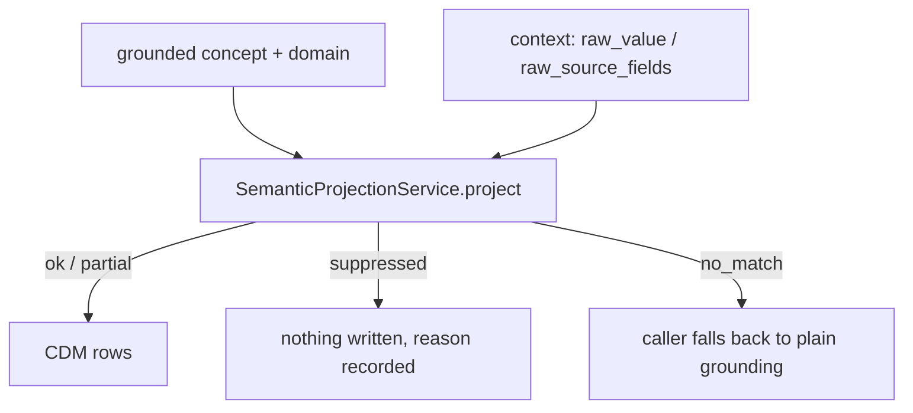

# SemanticProjectionService

`SemanticProjectionService` deterministically projects a grounded OMOP concept
into one or more CDM rows. It wraps [`omop-semantics`](https://australiancancerdatanetwork.github.io/omop-semantics/)'s
`OutputDefinitionRuntime`; it makes no LLM or database calls, and the same input
always produces the same output.

It exists for cases a single grounded `concept_id` can't express on its own — a diagnosis paired with a separately-collected role/status field, a family- history statement where the grounded condition belongs in the OMOP value slot, or a Yes/No field whose negative answer should produce no record at all. Ordinary single-concept mappings don't need it.

## Construction

Unlike the other services documented here, `SemanticProjectionService` is **not** part of `app.services` — it needs no adapter (no database, no LLM), so it doesn't participate in the `build_application()` / `Services` composition described in [Architecture](../architecture.md). It's constructed directly where it's registered, the same way `KnowledgeCatalogue` is:

```python
from groundworkers.services.semantic_projection import SemanticProjectionService

service = SemanticProjectionService()
```

Compiling the catalogue happens once, at construction — an invalid definition (a `derivation_rules` entry pointing at a slot the profile doesn't allow, for example) raises immediately rather than failing on the first request that happens to hit it. `create_server()` builds one instance at startup when `groundworkers.semantic_projection_enabled = true`; see [Configuration](../usage/configuration.md#semantic_projection).

Pass a custom `definitions` iterable to test against a smaller catalogue, or to run a project-specific set instead of the built-in one:

```python
service = SemanticProjectionService(definitions=my_definitions)
```

## The built-in catalogue

| Name | Pattern |
|---|---|
| `condition_with_status_from_secondary_field` | A diagnosis paired with a separately-collected role/status field (Primary/Contributing/Non-contributing). Populates `condition_status_concept_id` from the role field's raw code; the Non-contributing code drops the row. |
| `family_history_condition` | A value-carried family-history observation. The fixed OMOP entity concept `4167217` ("Family history of clinical finding") carries the family-history meaning; the grounded plain condition lands in `value_as_concept_id`. Known non-emitting family-history codes suppress the row. |
| `family_member_history_bundle` | A multi-row family-member bundle. One relative emits several coordinated observation rows: relationship label, birth year, age-at-death, age-at-onset, method-of-evaluation text, primary diagnosis, and secondary diagnosis, with row-level links showing that they belong to the same relative. |
| `criteria_gate_condition` | A Yes/No field phrased "meets criteria for X". The positive answer keeps the row; the negative answer drops it — a negative answer carries no positive clinical content of its own. |
| `yes_no_observation` | An ordinary Yes/No observation where both answers remain informative. Raw `1`/`0` map to OMOP answer concepts in `value_as_concept_id`; unlike a gate, `0` still writes a row. |
| `measurement_numeric_with_unit_from_context` | A quantitative measurement with a literal numeric value plus a derived OMOP unit concept. Shows how projection can bind both direct source values and code-mapped slots. |

These definitions are meant to be illustrative as well as useful. The first four cover the most common "why projection exists at all" cases: sibling-field modifiers, value-carried family-history shapes, multi-row relative bundles, and deterministic row suppression. The latter two show that projection is also a good fit for ordinary coded observations and quantitative measurements once callers already know the row shape they want.

## Method

### `project`

```python
service.project(request: SemanticProjectionRequest) -> SemanticProjectionResult
```

`SemanticProjectionRequest` fields:

| Field | Type | Notes |
|---|---|---|
| `grounded_concept_id` | `int` | required |
| `grounded_domain` | `str` | required |
| `grounded_concept_name` | `str \| null` | |
| `source_text` | `str \| null` | |
| `source_item_id` | `str \| null` | |
| `definition_hint` | `str \| null` | see below |
| `context` | `dict` | see below |

`context` carries whatever the selected definition needs beyond the grounded concept itself:

- `raw_value` — the grounded field's own raw source code. Consulted by a `SpecialValuePolicy` (e.g. `criteria_gate_condition`'s Yes/No check) or a `DerivationRule` (e.g. `yes_no_observation`'s Yes/No answer mapping).
- `raw_source_fields` — a mapping of well-known slot name to raw value, for definitions that resolve a row's slot from a *different* source field via a `DerivationRule` (e.g. `condition_with_status_from_secondary_field`'s role field).
- `numeric_value` — a literal numeric reading for quantitative projections such as `measurement_numeric_with_unit_from_context`.

### Selecting a definition

Pass `definition_hint` to select a definition explicitly; otherwise the service
matches on `grounded_domain` alone.

### Result

`SemanticProjectionResult.status` is one of:

| Status | Meaning |
|---|---|
| `ok` | A definition matched and every row is fully bound. |
| `partial` | A definition matched but some row still needs more context (`unresolved_fields`). |
| `suppressed` | A definition matched but every row it would have produced was dropped by a `DerivationRule` or `SpecialValuePolicy` (`suppressed_rows`) — nothing should be written. |
| `no_match` | No definition matched, including an ambiguous domain match with no `definition_hint`. |

Suppressed rows are listed in `suppressed_rows` (with the reason noted). A `status="suppressed"` result should be interpreted as a deterministic answer to "write nothing here" (as opposed to being skipped / unable to match).

## Typical input/output

```python
from groundworkers.services.semantic_projection import SemanticProjectionRequest

result = service.project(
    SemanticProjectionRequest(
        grounded_concept_id=4152280,
        grounded_domain="Condition",
        definition_hint="condition_with_status_from_secondary_field",
        context={"raw_source_fields": {"role_field": "1"}},
    )
)
```

```python
SemanticProjectionResult(
    definition_name="condition_with_status_from_secondary_field",
    role="condition_modifier",
    status="ok",
    rows=[
        ProjectedRowModel(
            row_id="condition",
            table="condition_occurrence",
            fields={"condition_concept_id": 4152280, "condition_status_concept_id": 32902},
        )
    ],
    ...
)
```

## When to use it

Use `SemanticProjectionService` when:

- a single grounded concept needs a second CDM column populated from a sibling source field's raw value
- a fixed entity concept should carry context like family history while the grounded concept belongs in a value slot
- a source item should sometimes produce no CDM record at all, and that decision needs to be deterministic and auditable rather than implicit in caller code
- a quantitative projection needs both a direct numeric literal and a mapped OMOP unit concept
- you want the same request to always produce the same result, with no LLM call in the path

Do not use it for:

- ordinary single-concept grounding — that's `ConceptGroundingService` / `concept_ground`
- deciding *which* definition applies from free text or ambiguous context — callers must be able to pass a suggested `definition_hint`

## Relationship to downstream mapping



## Interactive exploration

Launch the real catalogue through the worker-backed TUI with:

```bash
groundworkers --tui
```

This opens the same built-in definitions the service executes for `semantic_project`, but in an interactive terminal flow where you can browse the catalogue, start from definition-specific example payloads, run them, and inspect the result without standing up an MCP client first.

## Error handling

- Raises `ValueError` at construction time for an invalid definition (bad `derivation_rules`/`special_value_policy` reference, duplicate row id, dangling link rule) — this is a startup-time failure, not a per-request one.
- `project()` itself does not raise for ordinary "nothing matched" outcomes — those are `status="no_match"` results, not exceptions.
- A `SpecialValuePolicy` configured with `suppression_mode="fail"` raises `ValueError` from `project()` if its trigger value actually occurs — that mode exists for values that should never reach projection.
- `keep_as_value` and `keep_as_modifier` suppression modes raise `NotImplementedError` if triggered; no shipped definition uses them yet.
