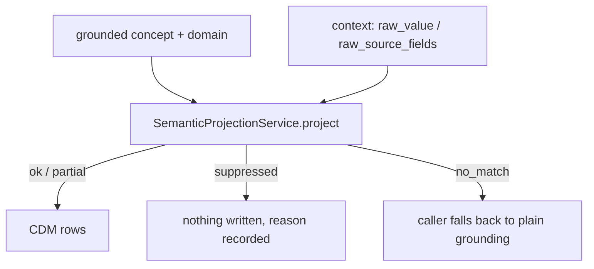

# SemanticProjectionService

`SemanticProjectionService` deterministically projects a grounded OMOP concept
into one or more CDM rows. It wraps [`omop-semantics`](https://australiancancerdatanetwork.github.io/omop-semantics/)'s
`OutputDefinitionRuntime`: no LLM call, no database access. The same input
always produces the same output.

It exists for cases a single grounded `concept_id` can't express on its own —
a diagnosis paired with a separately-collected role/status field, or a Yes/No
field whose negative answer should produce no record at all. Ordinary
single-concept mappings don't need it.

## Construction

Unlike the other services documented here, `SemanticProjectionService` is
**not** part of `app.services` — it needs no adapter (no database, no LLM), so
it doesn't participate in the `build_application()` / `Services` composition
described in [Architecture](../architecture.md). It's constructed directly
where it's registered, the same way `KnowledgeCatalogue` is:

```python
from groundworkers.services.semantic_projection import SemanticProjectionService

service = SemanticProjectionService()
```

Compiling the catalogue happens once, at construction — an invalid definition
(a `derivation_rules` entry pointing at a slot the profile doesn't allow, for
example) raises immediately rather than failing on the first request that
happens to hit it. `create_server()` builds one instance at startup when
`groundworkers.semantic_projection.enabled = true`; see
[Configuration](../usage/configuration.md#semantic_projection).

Pass a custom `definitions` iterable to test against a smaller catalogue, or
to run a project-specific set instead of the built-in one:

```python
service = SemanticProjectionService(definitions=my_definitions)
```

## The built-in catalogue

Two definitions ship today, both `Condition`-domain, both requiring
`definition_hint` (see below):

| Name | Pattern |
|---|---|
| `condition_with_status_from_secondary_field` | A diagnosis paired with a separately-collected role/status field (Primary/Contributing/Non-contributing). Populates `condition_status_concept_id` from the role field's raw code; the Non-contributing code drops the row. |
| `criteria_gate_condition` | A Yes/No field phrased "meets criteria for X". The positive answer keeps the row; the negative answer drops it — a negative answer carries no positive clinical content of its own. |

These correspond to the `diagnosis-role-modifier` and `criteria-gate-yesno`
core knowledge packs — this service is the deterministic counterpart to that
guidance, not a replacement for it. The packs tell an LLM how to recognize the
pattern; this service executes it once recognized.

## Method

### `project`

```python
service.project(request: SemanticProjectionRequest) -> SemanticProjectionResult
```

`SemanticProjectionRequest` fields:

| Field | Type | Notes |
|---|---|---|
| `grounded_concept_id` | `int` | required |
| `grounded_domain` | `str` | required |
| `grounded_concept_name` | `str \| null` | |
| `source_text` | `str \| null` | |
| `source_item_id` | `str \| null` | |
| `definition_hint` | `str \| null` | see below |
| `context` | `dict` | see below |

`context` carries whatever the selected definition needs beyond the grounded
concept itself:

- `raw_value` — the grounded field's own raw source code. Consulted by a
  `SpecialValuePolicy` (e.g. `criteria_gate_condition`'s Yes/No check).
- `raw_source_fields` — a mapping of well-known slot name to raw value, for
  definitions that resolve a row's slot from a *different* source field via a
  `DerivationRule` (e.g. `condition_with_status_from_secondary_field`'s role
  field). The key is whatever the definition documents in its `notes` —
  `role_field` today — not the field's actual name in your source data.

### Selecting a definition

Pass `definition_hint` to select a definition explicitly. Omit it and the
service falls back to matching on `grounded_domain` alone — but only resolves
when exactly one registered definition applies to that domain. With both
built-in definitions on `Condition`, that fallback is always ambiguous today;
`definition_hint` is effectively required until a non-colliding definition is
added. This is deliberate: the service reports `status="no_match"` with an
audit note rather than guessing.

### Result

`SemanticProjectionResult.status` is one of:

| Status | Meaning |
|---|---|
| `ok` | A definition matched and every row is fully bound. |
| `partial` | A definition matched but some row still needs more context (`unresolved_fields`). |
| `suppressed` | A definition matched but every row it would have produced was dropped by a `DerivationRule` or `SpecialValuePolicy` (`suppressed_rows`) — nothing should be written. |
| `no_match` | No definition matched, including an ambiguous domain match with no `definition_hint`. |

Suppressed rows are never silently absent from `rows` — they're always listed
in `suppressed_rows` with the reason, the source field consulted, and the raw
code that triggered it. A `status="suppressed"` result carries exactly as much
information as an `ok` one; it just says the deterministic answer is "write
nothing here."

## Typical input/output

```python
from groundworkers.services.semantic_projection import SemanticProjectionRequest

result = service.project(
    SemanticProjectionRequest(
        grounded_concept_id=4152280,
        grounded_domain="Condition",
        definition_hint="condition_with_status_from_secondary_field",
        context={"raw_source_fields": {"role_field": "1"}},
    )
)
```

```python
SemanticProjectionResult(
    definition_name="condition_with_status_from_secondary_field",
    role="condition_modifier",
    status="ok",
    rows=[
        ProjectedRowModel(
            row_id="condition",
            table="condition_occurrence",
            fields={"condition_concept_id": 4152280, "condition_status_concept_id": 32902},
        )
    ],
    ...
)
```

Role field code `"3"` (Non-contributing) instead of `"1"` produces
`status="suppressed"`, `rows=[]`, and one `suppressed_rows` entry.

## When to use it

Use `SemanticProjectionService` when:

- a single grounded concept needs a second CDM column populated from a
  sibling source field's raw value
- a source item should sometimes produce no CDM record at all, and that
  decision needs to be deterministic and auditable rather than implicit in
  caller code
- you want the same request to always produce the same result, with no LLM
  call in the path

Do not use it for:

- ordinary single-concept grounding — that's `ConceptGroundingService` /
  `concept_ground`
- deciding *which* definition applies from free text or ambiguous context —
  that inference doesn't exist yet (see the implementation-plan notes in
  agent-stack's `SEMANTIC_INTEGRATION` design docs); today's callers must
  already know to pass `definition_hint`

## Relationship to downstream mapping



## Interactive exploration

Launch the real catalogue through the worker-backed TUI with:

```bash
groundworkers --tui
```

This opens the same two built-in definitions the service executes for
`semantic_project`, but in an interactive terminal flow where you can browse the
catalogue, edit a request-shaped JSON payload, run it, and inspect the result
without standing up an MCP client first.

## Error handling

- Raises `ValueError` at construction time for an invalid definition (bad
  `derivation_rules`/`special_value_policy` reference, duplicate row id,
  dangling link rule) — this is a startup-time failure, not a per-request one.
- `project()` itself does not raise for ordinary "nothing matched" outcomes —
  those are `status="no_match"` results, not exceptions.
- A `SpecialValuePolicy` configured with `suppression_mode="fail"` raises
  `ValueError` from `project()` if its trigger value actually occurs — that
  mode exists for values that should never reach projection.
- `keep_as_value` and `keep_as_modifier` suppression modes raise
  `NotImplementedError` if triggered; no shipped definition uses them yet.
