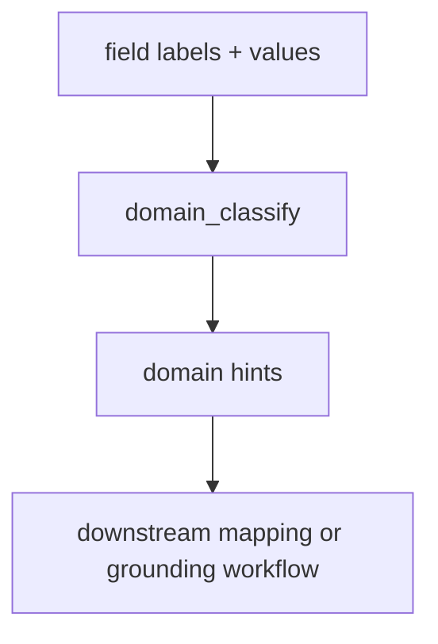

# Domain Tools

`domain_classify` is the MCP surface for batch OMOP domain classification of structured field labels. It is registered only when `llm` is configured.

This tool is meant for structured sources such as data dictionaries, schema-like field inventories, and form definitions. It is not a concept grounding tool.

It is a thin wrapper over `DomainService`.

---

## `domain_classify`

Classifies field labels into OMOP domains using the label text and any example response values supplied by the caller.

```json
{
  "label_values": {
    "haemoglobin": ["12.1", "13.4", "11.8"],
    "smoking status": ["current", "former", "never"],
    "biopsy performed": ["yes", "no"]
  },
  "model_name": null
}
```

`label_values` is required. It maps each field label to a list of example response-value strings. Use an empty list when no values are known.

`model_name` is optional and overrides the default model from the LLM config for this call.

**Response:**

```json
{
  "classifications": {
    "haemoglobin": "Measurement",
    "smoking status": "Observation",
    "biopsy performed": "Procedure"
  }
}
```

Only confident classifications are returned. Labels that the model cannot place confidently into a single OMOP domain are omitted so the caller can continue with fallback logic.

Valid returned domains are:

- `Measurement`
- `Condition`
- `Observation`
- `Procedure`
- `Drug`
- `Device`

The classifier can also return `Metadata` and `Identifier`. These are Groundcrew-facing sentinel values, not OMOP CDM domains: they identify administrative/data-collection fields and record-linkage fields that downstream ingestion should skip rather than ground.

**When to use it:**

Use `domain_classify` when:

- you have many structured labels to classify at once
- you want domain hints before concept grounding or source planning
- your caller already knows the source is field-oriented rather than free text

Prefer text tools when you need to normalize or decompose clinical phrases. Prefer mapping or search tools when you already have a term to ground.

**Error cases:**

| Error code | Condition |
|---|---|
| `BACKEND_UNAVAIL` | LLM API unreachable, authentication failure, or LLM backend not configured |
| `QUERY_ERROR` | Model API error or response could not be parsed |

## Typical downstream use



The tool is deliberately narrow: it helps a caller decide what OMOP domain to search within, but it does not attempt to return OMOP concepts or candidate mappings itself.
