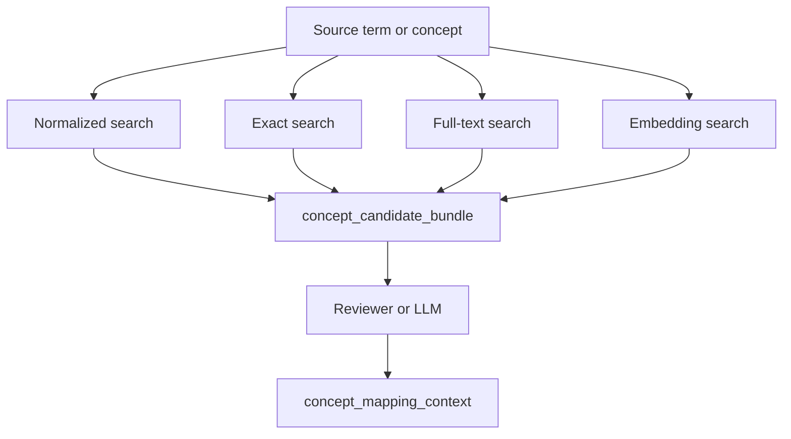

# Mapping Tools

These tools are for mapping and review workflows where the caller usually wants
more than a single "best guess". They help you gather evidence, inspect context,
and compare candidates.

## When to use these tools

Use the mapping tools when you want to:

- compare exact, normalized, full-text, and embedding retrieval side by side
- build a reviewer or LLM-facing candidate packet
- ask for broader parent concepts when a hit is too specific
- assemble one context object for a chosen concept
- expand simple concept expressions
- evaluate predicted mappings against a reference set

## How they fit together



## `concept_ground` vs mapping tools

`concept_ground` is still the simplest choice when you want one good answer fast.

The mapping tools are better when you want to inspect evidence and make an explicit
selection.

| If you want... | Prefer... |
|---|---|
| One best-answer grounding result | `concept_ground` |
| Multiple retrieval channels in one packet | `concept_candidate_bundle` |
| Deterministic normalized matching before ranked retrieval | `concept_search_normalized` |
| Rich context for a selected concept | `concept_mapping_context` |

## `concept_search_normalized`

Deterministic normalized equality search over concept labels, with optional synonym
matching and explicit normalization metadata in the response.

```json
{
  "query": "Type-II diabetes mellitus",
  "domain": "Condition",
  "include_synonyms": false,
  "normalization_profile": "verbatim",
  "remove_stop_phrases": true
}
```

Useful response fields:

- `normalized_query`
- `normalization_steps`
- `results[*].matched_text`
- `results[*].matched_text_normalized`
- `results[*].match_mode`

## `concept_candidate_bundle`

Builds one evidence packet by combining:

- exact search
- normalized search
- full-text search
- embedding search
- optional standard mappings
- optional hierarchy preview
- optional relationship summary

```json
{
  "query": "type 2 diabetes",
  "domain": "Condition",
  "include_normalized": true,
  "include_fulltext": true,
  "include_embedding": true,
  "include_standard_mappings": true,
  "include_hierarchy_context": true
}
```

Representative response sections:

- `channels`
- `standardized_candidates`
- `candidate_union`
- `warnings`

## `concept_parent_backoff`

Selects a broader standard parent concept from either a free-text query or an
explicit `concept_id`.

```json
{
  "query": "left lower lobe lung adenocarcinoma",
  "domain": "Condition",
  "strategy": "nearest_standard_ancestor",
  "max_depth": 5
}
```

Useful response fields:

- `seed_candidates`
- `selected_parent`
- `selection_reason`
- `path_to_parent`
- `alternative_parents`

## `concept_mapping_context`

Builds one deterministic context packet for a known concept ID so the caller does
not have to stitch together multiple lower-level calls.

```json
{
  "concept_id": 201826,
  "include_standard_mapping": true,
  "include_ancestors": true,
  "include_relationship_summary": true,
  "include_neighbors": true,
  "include_embedding_neighbors": true
}
```

Possible sections include:

- `concept`
- `standard_mapping`
- `ancestors`
- `descendants`
- `relationship_summary`
- `neighbors`
- `embedding_neighbors`
- `warnings`

## `concept_map_to_value`

Finds `Maps to value` relationships for a source vocabulary ID and concept code.

```json
{
  "vocabulary_id": "ICDO3",
  "concept_code": "8500/3"
}
```

## `concept_resolve_mapping_expression`

Expands a simple list of concept items with support for:

- `concept_id`
- `include_descendants`
- `exclude`

```json
{
  "items": [
    {"concept_id": 201826},
    {"concept_id": 443392, "include_descendants": true},
    {"concept_id": 320128, "exclude": true}
  ],
  "domain": "Condition",
  "deduplicate": true,
  "resolve_to_standard": true
}
```

## `mapping_evaluate_candidates`

Compares predicted mappings with a reference mapping set using
`standard_concept_id` agreement.

```json
{
  "predicted_mappings": [
    {
      "source_term": "type 2 diabetes",
      "domain_id": "Condition",
      "predicted_standard_concept_ids": [201826]
    }
  ],
  "reference_mappings": [
    {
      "source_term": "type 2 diabetes",
      "domain_id": "Condition",
      "reference_standard_concept_id": 201826
    }
  ]
}
```

Useful response sections:

- `summary_metrics`
- `by_domain`
- `agreement_cases`
- `disagreement_cases`
- `missing_reference_cases`
- `extra_prediction_cases`

## Direct Python use

These workflows are also available directly through `app.services.mapping`.

```python
from groundworkers.app import build_application

app = build_application(config)
mapping = app.services.mapping

bundle = mapping.concept_candidate_bundle("type 2 diabetes", domain="Condition")
context = mapping.concept_mapping_context(201826)
```
