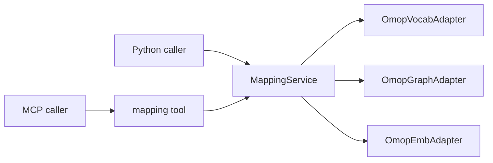

# Tools Overview

groundworkers registers six tool groups. Tools appear only when the relevant
adapters are available in the config.

| Group | Tools | Requires |
|---|---|---|
| **Concept** | `concept_get`, `concept_by_code`, `concept_ancestors`, `concept_descendants`, `concept_relationships`, `concept_equivalency_path`, `concept_path`, `concept_neighbors`, `concept_map_to_standard` | `omop_graph` |
| **Resolver** | `concept_ground` | `omop_graph` |
| **Search** | `concept_search_exact`, `concept_search_fulltext`, `concept_navigate_to_standard` | `omop_vocab` |
| **Mapping** | `concept_search_normalized`, `concept_candidate_bundle`, `concept_parent_backoff`, `concept_mapping_context`, `concept_map_to_value`, `concept_resolve_mapping_expression`, `mapping_evaluate_candidates` | `MappingService` |
| **Embedding** | `embedding_index_status`, `embedding_neighbours`, `embedding_search`, `embedding_encode` | `omop_emb` |
| **System** | `system_status`, `system_vocabulary_catalogue` | Always registered |

!!! info "System tools are always registered"
    `system_status` and `system_vocabulary_catalogue` are always present so clients can
    check what is available in the current deployment.

## Tool groups at a glance

**Concept tools** return deterministic OMOP facts from known identifiers.

**Resolver tools** take free text and try to return the best grounded answer.

**Search tools** expose lower-level lexical retrieval with raw quality signals.

**Mapping tools** are aimed at review and adjudication workflows where the caller
often wants multiple evidence channels side by side.

**Embedding tools** expose the embedding index directly.

## Mapping tools and direct Python use

The mapping group is also available directly through `app.services.mapping`.



If you are building a Python application, this is the highest-level place to start.

## Error response shape

Every tool returns a plain dict. On failure the dict has:

```json
{"error": true, "code": "ERROR_CODE", "message": "Human-readable description"}
```

| Code | Meaning |
|---|---|
| `NOT_FOUND` | Requested concept ID or code does not exist |
| `INVALID_INPUT` | Bad argument such as a non-positive `concept_id` or empty string |
| `BACKEND_UNAVAIL` | Required adapter is not configured or a backend is unavailable |
| `QUERY_ERROR` | Database or adapter error during the query |

## Input validation

All tools validate their inputs before hitting the adapter:

- `concept_id` must be a positive integer (`> 0`)
- string arguments such as `vocabulary_id`, `concept_code`, and `query` must be non-empty after stripping
- `limit` arguments for search and embedding results are clamped to `[1, 50]`
- `max_depth` for `concept_ancestors` is clamped to `[1, 20]`
- `max_depth` for `concept_descendants` is clamped to `[1, 10]`
- `max_depth` for `concept_neighbors` is clamped to `[1, 4]`
- `max_nodes` for `concept_neighbors` is clamped to `[10, 500]`
- mapping bundle `per_channel_limit` is clamped to `[1, 20]`
- mapping bundle `overall_limit` is clamped to `[1, 100]`

Validation failures return `INVALID_INPUT` without touching the database.

## Inspecting registered tools

```bash
groundworkers --config /path/to/config.yaml --describe
```

This prints a JSON object with each registered tool's signature and docstring, which
is useful when you want to confirm what is active in a particular deployment.
