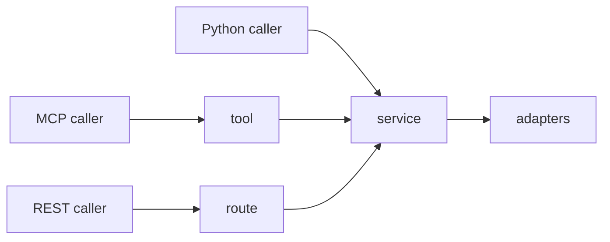

# Tools Overview

The MCP surface in `groundworkers` is grouped by workflow rather than by
underlying package. Tool availability is resolved from the active runtime at
startup.

## Tool groups

| Group | Tools | Requires |
|---|---|---|
| **Concept** | `concept_get`, `concept_by_code`, `concept_ancestors`, `concept_descendants`, `concept_relationships`, `concept_equivalency_path`, `concept_path`, `concept_neighbors`, `concept_map_to_standard` | `GraphService` / omop-graph backend |
| **Resolver** | `concept_ground` | `ConceptGroundingService` / omop-graph backend |
| **Search** | `concept_search_exact`, `concept_search_fulltext`, `concept_navigate_to_standard` | Shared CDM vocabulary access / `VocabService` |
| **Mapping** | `concept_search_normalized`, `concept_candidate_bundle`, `concept_nearest_standard_ancestor`, `concept_mapping_context`, `concept_map_to_value`, `concept_resolve_mapping_expression`, `mapping_evaluate_candidates` | Shared CDM resource / `MappingService` |
| **Embedding** | `embedding_index_status`, `embedding_neighbours`, `embedding_search`, `embedding_encode` | `omop_emb` configured |
| **Source planning** | `source_plan`, `source_plan_assisted` | `SourcePlanningService` |
| **Knowledge** | `knowledge_catalogue` | Knowledge-pack catalogue available |
| **Text** | `text_normalize`, `text_decompose`, `text_disambiguate` | LLM enabled |
| **Domain** | `domain_classify` | LLM enabled |
| **System** | `system_status`, `system_vocabulary_catalogue` | Always registered |

## What each group is for

- **Concept** tools return deterministic OMOP facts from known identifiers.
- **Resolver** tools take free text and try to ground it to ranked concepts.
- **Search** tools expose lexical retrieval with raw retrieval signals.
- **Mapping** tools assemble multi-channel evidence for review and adjudication workflows.
- **Embedding** tools expose the embedding index directly.
- **Source planning** tools prepare source artifacts into neutral pre-ingest structures.
- **Knowledge** tools expose the bundled baseline pack catalogue and any configured
  site/localisation packs that apply to a job context.
- **Text** tools normalize or decompose free text before retrieval.
- **Domain** tools classify structured labels into OMOP domains.
- **System** tools expose runtime availability and vocabulary catalogue metadata.

## Registration rules

`system_status` and `system_vocabulary_catalogue` are always present so clients
can inspect the deployment before assuming a capability exists.

All other tool groups appear only when their backing services or backend
wrappers are available in the resolved runtime.

## MCP versus REST

The MCP surface is broader than the REST surface.

- MCP is the discovery-oriented interface
- REST is a curated workflow interface over selected services

If you need the full capability surface, MCP is the more complete transport. If
you are building a fixed HTTP workflow, prefer the REST routes documented in
[Integrations](../usage/integrations.md).

## Direct Python use

The graph, grounding, mapping, search, text, domain, and source-planning
behavior also exists as direct Python services:



If you are building a Python application, call `app.services.*` directly rather
than importing tool modules.

## Error response shape

On failure, tools return a plain dict:

```json
{"error": true, "code": "ERROR_CODE", "message": "Human-readable description"}
```

Common codes:

| Code | Meaning |
|---|---|
| `NOT_FOUND` | Requested concept or code does not exist |
| `INVALID_INPUT` | Bad argument such as an empty string or invalid identifier |
| `BACKEND_UNAVAIL` | Required backend or service dependency is unavailable |
| `QUERY_ERROR` | Database or adapter failure during execution |

## Inspecting the active tool surface

```bash
groundworkers --describe
```

This prints the active runtime config plus the registered tool, prompt, and
resource surfaces for the currently selected stack file and profile.
