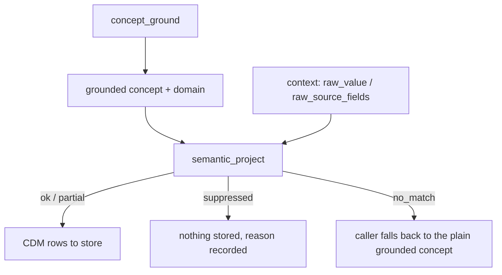

# Semantic Projection Tools

`semantic_project` is the MCP surface for deterministic semantic projection — turning a grounded OMOP concept into one or more CDM rows. It is registered only when `groundworkers.semantic_projection_enabled = true` (default `false`; see [Configuration](../usage/configuration.md#semantic_projection)).

It is not a grounding tool. Callers ground a concept first (`concept_ground`, or their own logic) and pass the result in. It is a thin wrapper over `SemanticProjectionService` — see [SemanticProjectionService](../services/semantic_projection.md) for the full definition catalogue and selection rules.

---

## `semantic_project`

```json
{
  "grounded_concept_id": 4152280,
  "grounded_domain": "Condition",
  "grounded_concept_name": "Major depressive disorder",
  "definition_hint": "condition_with_status_from_secondary_field",
  "context": {
    "raw_source_fields": {"role_field": "1"}
  }
}
```

`grounded_concept_id` and `grounded_domain` are required. Everything else is optional.

`definition_hint` selects a definition explicitly. Omit it only when exactly one registered definition applies to `grounded_domain`.

`context` carries whatever the selected definition needs beyond the grounded concept itself — see the field-by-field description in [SemanticProjectionService](../services/semantic_projection.md#method).

**Response (row kept):**

```json
{
  "definition_name": "condition_with_status_from_secondary_field",
  "role": "condition_modifier",
  "status": "ok",
  "rows": [
    {
      "row_id": "condition",
      "table": "condition_occurrence",
      "fields": {
        "condition_concept_id": 4152280,
        "condition_status_concept_id": 32902
      }
    }
  ],
  "links": [],
  "constraint_checks": [],
  "unresolved_fields": [],
  "suppressed_rows": [],
  "audit_notes": ["Diagnosis paired with a separately-collected Primary/Contributing/Non-contributing role field. ..."]
}
```

**Response (row suppressed — role field raw code `"3"`, Non-contributing):**

```json
{
  "definition_name": "condition_with_status_from_secondary_field",
  "role": "condition_modifier",
  "status": "suppressed",
  "rows": [],
  "links": [],
  "constraint_checks": [],
  "unresolved_fields": [],
  "suppressed_rows": [
    {
      "row_id": "condition",
      "reason": "derivation rule for 'condition_status_concept_id' matched a suppress code on 'source.raw_source_fields.role_field'",
      "source_field": "source.raw_source_fields.role_field",
      "source_code": "3"
    }
  ],
  "audit_notes": []
}
```

Nothing is silently missing here — `rows` is empty *and* `suppressed_rows` explains why, with the exact source field and code that triggered it.

**Response (no hint, ambiguous domain):**

```json
{
  "definition_name": null,
  "role": null,
  "status": "no_match",
  "rows": [],
  "links": [],
  "constraint_checks": [],
  "unresolved_fields": [],
  "suppressed_rows": [],
  "audit_notes": [
    "4 definitions match domain 'Condition' ['condition_with_status_from_secondary_field', 'criteria_gate_condition', 'family_history_condition', 'family_member_history_bundle']; pass definition_hint to disambiguate"
  ]
}
```

**When to use it:**

Use `semantic_project` when:

- a grounded item needs a second CDM column populated from a sibling source field (a role/status pairing)
- a fixed entity concept should carry context like family history while the grounded plain concept belongs in the OMOP value slot
- a source item should sometimes produce no CDM record at all, deterministically and auditably, rather than via ad hoc caller logic
- a grounded quantitative finding needs both a literal numeric value and a mapped OMOP unit concept
- you need the same input to always produce the same output — there is no LLM call anywhere in this path


**Error cases:**

| Error code | Condition |
|---|---|
| `INVALID_INPUT` | Request failed validation (e.g. non-numeric `grounded_concept_id`) |
| `QUERY_ERROR` | Definition execution failed unexpectedly (e.g. a `suppression_mode="fail"` policy actually triggered) |

A `NOT_FOUND`-style outcome for an unknown `definition_hint` is *not* an error — it comes back as `status="no_match"` with an audit note naming the unknown hint, since the request was well-formed and the server made a deterministic decision about it.

## Typical downstream use


