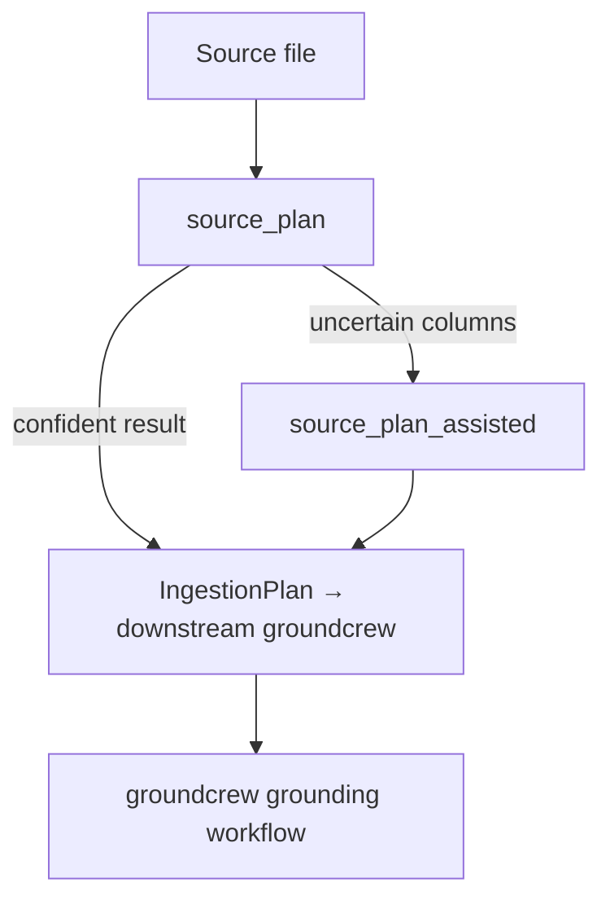

# Source Planning Tools

Two tools decompose, normalize, and annotate raw source data files into neutral
grounding artifacts. Both are always registered. `source_plan_assisted` additionally
requires an `llm` adapter and returns `BACKEND_UNAVAIL` without one.

They are thin wrappers over `SourcePlanningService`.

---

## What source planning produces

Source planning runs a four-stage pipeline on submitted content:

```
Raw content → RawTable(s) → NormalisedTable(s) → AnnotatedTable(s) → IngestionPlan
```

The `IngestionPlan` is the primary output. It describes:

- the detected source format (`CSV`, `XLSX`, `PDF`, `DOCX`, `XML`, `JSON`, `DDL_SQL`)
- per-table column annotations (role, detection tier, confidence)
- an `IngestionStrategy` for each table
- any planning warnings or hard errors

The optional intermediate artifacts (`raw_tables`, `normalised_tables`,
`annotated_tables`) are available for inspection by setting
`include_intermediate: true`.

---

## `source_plan`

Plans submitted source content using the deterministic classification pipeline
(canonical-header matching and heuristic rules). No LLM is required.

```json
{
  "content": "variable_name,label,value_set\nAGE,Age in years,\nSEX,Sex,1=Male|2=Female",
  "filename": "data_dictionary.csv",
  "caller_hint": null,
  "content_encoding": "utf-8",
  "include_intermediate": false
}
```

`content` is required. All other parameters are optional.

`filename` is used for format detection when the content itself is ambiguous.

`caller_hint` is a free-text string passed to the router as a format hint — for
example `"REDCap data dictionary"` or `"OMOP-style DDL"`.

`content_encoding` must be `"utf-8"` (default) for text formats, or `"base64"`
for binary formats (XLSX, PDF, DOCX). Pass the base64-encoded bytes as `content`
when using the binary path.

`include_intermediate` returns the raw, normalised, and annotated table lists
alongside the final plan (useful for debugging or UI inspection).

**Response:**

```json
{
  "plan": {
    "format_detected": "CSV",
    "caller_hint": null,
    "hint_matches": true,
    "tables": [...],
    "strategies": ["DATA_DICT_IDEAL"],
    "warnings": [],
    "errors": []
  },
  "raw_tables": null,
  "normalised_tables": null,
  "annotated_tables": null,
  "warnings": [],
  "errors": [],
  "elapsed_ms": 12,
  "llm_tier_used": false
}
```

`plan.strategies` contains one `IngestionStrategy` per entry in `plan.tables`.

| Strategy | Meaning |
|---|---|
| `DATA_DICT_IDEAL` | Table has codes plus enough semantic context for direct data-dictionary ingestion |
| `DATA_DICT_SCHEMA` | Label/attribute-style structure but lacks explicit code columns |
| `DATA_DICT_PACKED_VALUES` | Value sets are encoded inside cells and should be expanded during ingestion |
| `OWL_ONTOLOGY` | Declared for ontology-style sources; not yet routed |
| `FREE_TEXT_EXTRACT` | Declared for free-text sources requiring extraction; not yet routed |
| `UNSUPPORTED` | No supported ingestion path was found |

Each table in `plan.tables` contains `column_annotations` mapping each header to:

- `role` — the assigned `ColumnRole` (see `source-planning://column-roles` resource)
- `detection_tier` — `"A"` (canonical header), `"B"`, `"C"`, `"D"`, or `"LLM"`
- `confidence` — float in `[0, 1]`
- `inferred_vocab` — vocabulary hint when detected
- `packed_value` — whether the column encodes a value set

**Supported input formats:**

`CSV`, `XLSX`, `XML`, `JSON`, `DDL_SQL` (CREATE TABLE statements), `PDF`, `DOCX`

**Error cases:**

| Error code | Condition |
|---|---|
| `INVALID_INPUT` | Unrecognised `content_encoding`, or base64 content is malformed |
| `QUERY_ERROR` | Source content could not be parsed or an unexpected error occurred |

---

## `source_plan_assisted`

Runs the same pipeline as `source_plan` but enables explicit LLM-assisted
classification as a fallback tier when the deterministic pipeline is not confident
enough. Returns `BACKEND_UNAVAIL` when no `llm` is configured.

The arguments are identical to `source_plan`.

```json
{
  "content": "...",
  "filename": "custom_form.xlsx",
  "caller_hint": "bespoke clinical form",
  "content_encoding": "base64",
  "include_intermediate": false
}
```

When LLM assistance was used, `llm_tier_used: true` appears in the response and
affected columns will have `detection_tier: "LLM"` in their annotations.

Use `source_plan_assisted` as an explicit second-step path when you have already
called `source_plan` and found the result was not strong enough (e.g. many
uncertain columns, tables routed to `UNSUPPORTED`).

**Error cases:**

| Error code | Condition |
|---|---|
| `BACKEND_UNAVAIL` | `llm` adapter is not configured |
| `INVALID_INPUT` | Unrecognised `content_encoding`, or base64 content is malformed |
| `QUERY_ERROR` | Source content could not be parsed or an unexpected error occurred |

---

## Resources

Three MCP resources expose the reference data used by the classification pipeline:

- `source-planning://canonical-headers` — the Tier A canonical header catalogue
- `source-planning://column-roles` — `ColumnRole` values and descriptions
- `source-planning://ingestion-strategies` — `IngestionStrategy` values and descriptions

---

## Typical flow



Source planning is a stateless step: it produces neutral artifacts that downstream
orchestration (groundcrew) uses to decide which fields to ground and how. It does
not write to any database.
