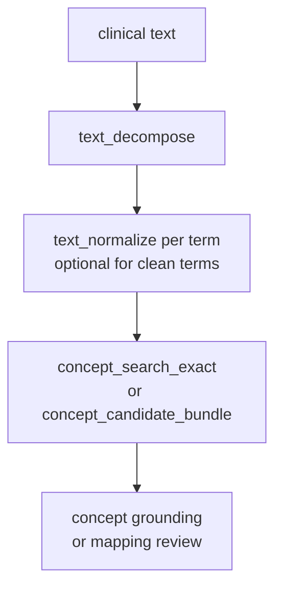
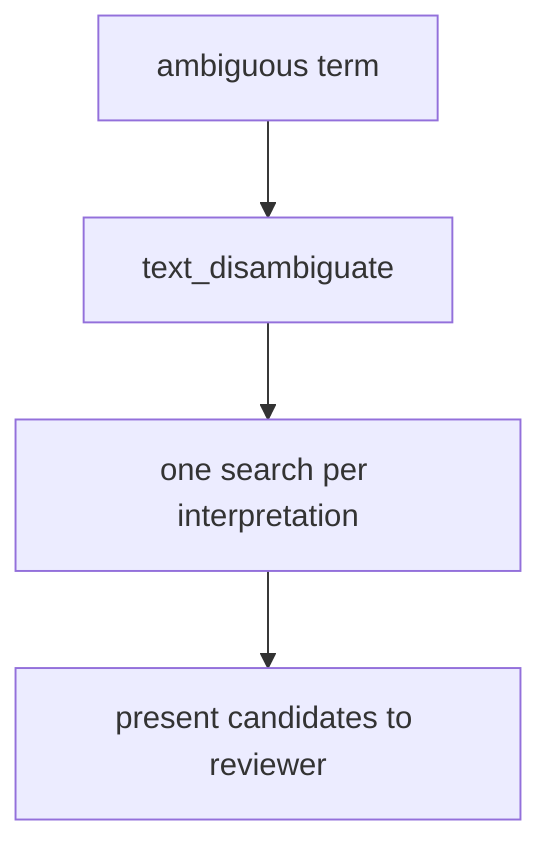

# Text Tools

Three tools preprocess clinical free text into forms suitable for concept grounding.
They are registered only when `llm` is configured. All three are thin wrappers over
`TextService`.

These tools are preprocessing steps, not grounding tools. Their outputs are inputs
to `concept_search_exact`, `concept_search_fulltext`, `concept_candidate_bundle`,
or `concept_ground`.

---

## `text_normalize`

Converts a clinical term, abbreviation, or lay phrase to OMOP-compatible form.

```json
{
  "text": "DM2",
  "domain_hint": "Condition",
  "model_name": null
}
```

`text` is required. `domain_hint` and `model_name` are optional.

`domain_hint` narrows the model toward a specific OMOP domain (`"Condition"`,
`"Drug"`, `"Measurement"`, `"Procedure"`, etc.). Use it when the same phrase has
different meanings in different domains — for example, `"MS"` means multiple
sclerosis in Condition but mass spectrometry in Measurement.

`model_name` overrides the default model from the LLM config for this call.

**Response:**

```json
{
  "normalized": "Type 2 diabetes mellitus",
  "original": "DM2",
  "confidence": "high",
  "notes": null
}
```

`confidence` is one of `"high"`, `"medium"`, or `"low"` — the model's categorical
self-assessment. `notes` is a free-text string when the model has commentary on
alternatives or ambiguity, otherwise `null`.

**When to use this vs the others:**

Use `text_normalize` when you have a single term that needs to be converted to
OMOP-compatible form before searching. If you have a multi-concept phrase, use
`text_decompose` first. If you are unsure whether the term is ambiguous, use
`text_disambiguate`.

**Error cases:**

| Error code | Condition |
|---|---|
| `INVALID_INPUT` | Empty or whitespace-only `text` |
| `BACKEND_UNAVAIL` | LLM API unreachable or authentication failure |
| `QUERY_ERROR` | Model API error or response could not be parsed |

---

## `text_decompose`

Splits a free-text clinical phrase into a list of individually normalized,
searchable terms.

```json
{
  "text": "patient with T2DM and HTN on metformin"
}
```

`text` is required. `domain_hint`, `max_terms` (integer, default 10, clamped 1-20),
and `model_name` are optional.

`domain_hint` provides context for the whole phrase. `max_terms` sets an upper bound
on the number of terms returned. `model_name` overrides the default model.

**Response:**

```json
{
  "terms": [
    {"term": "Type 2 diabetes mellitus", "domain_hint": "Condition"},
    {"term": "Hypertension", "domain_hint": "Condition"},
    {"term": "Metformin", "domain_hint": "Drug"}
  ],
  "original": "patient with T2DM and HTN on metformin"
}
```

Each term includes a `domain_hint` inferred by the model. Pass this `domain_hint`
value to subsequent search calls to narrow candidates to the right OMOP domain.

**When to use this vs the others:**

Use `text_decompose` when the input is a multi-concept phrase (a clinical note
fragment, a problem list entry, a free-text condition description). The result
gives you one normalized term per downstream search call. If the input is a single
term, `text_normalize` is simpler. If the term might have multiple valid
interpretations that you want to expose, use `text_disambiguate`.

**Error cases:**

| Error code | Condition |
|---|---|
| `INVALID_INPUT` | Empty or whitespace-only `text` |
| `BACKEND_UNAVAIL` | LLM API unreachable or authentication failure |
| `QUERY_ERROR` | Model API error or response could not be parsed |

---

## `text_disambiguate`

Returns ranked candidate interpretations of an ambiguous clinical term.

```json
{
  "text": "MS"
}
```

`text` is required. `domain_hint`, `max_interpretations` (integer, default 5, clamped
1-10), and `model_name` are optional.

`domain_hint` narrows the interpretation space to a specific OMOP domain.
`max_interpretations` sets an upper bound on the number of interpretations returned.

**Response:**

```json
{
  "interpretations": [
    {
      "interpretation": "Multiple sclerosis",
      "domain_hint": "Condition",
      "context_clues": "neurological abbreviation; common clinical shorthand"
    },
    {
      "interpretation": "Mitral stenosis",
      "domain_hint": "Condition",
      "context_clues": "cardiac abbreviation"
    }
  ],
  "original": "MS",
  "is_ambiguous": true
}
```

`is_ambiguous` is `true` when the model identified more than one plausible
interpretation. `context_clues` is a free-text string summarising the signals that
support each interpretation, or `null` when none were identified.

When `is_ambiguous` is `false` and only one interpretation is returned, the result
is semantically equivalent to a normalized result. In that case, `text_normalize`
would have produced the same output with less overhead.

**When to use this vs the others:**

Use `text_disambiguate` when you need to present the caller or a reviewer with
alternative concept candidates from a single ambiguous input. For example, when
building a review UI where a human will select the correct interpretation, or when
you want to generate candidates from multiple interpretations and rank them by
context. For unambiguous or multi-concept inputs, prefer `text_normalize` or
`text_decompose`.

**Error cases:**

| Error code | Condition |
|---|---|
| `INVALID_INPUT` | Empty or whitespace-only `text` |
| `BACKEND_UNAVAIL` | LLM API unreachable or authentication failure |
| `QUERY_ERROR` | Model API error or response could not be parsed |

---

## Grounding pipeline integration

The typical sequence when starting from noisy clinical text:



For ambiguous single terms:



Text tools add LLM latency and are optional. When the input is already in standard
clinical terminology, search tools can be called directly without preprocessing.
