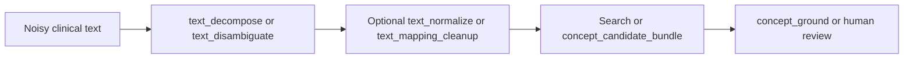

# Text tools

Text tools are optional LLM-backed preprocessing steps. They make noisy clinical input easier to retrieve; they do not select an OMOP concept or replace grounding. They are registered when a chat model is configured.

Use them only when the source text needs model-assisted interpretation. Exact, normalized, full-text, embedding, and grounding tools can be called directly when the input is already a useful clinical phrase.

## Choose the operation

| Input problem | Tool | Result |
|---|---|---|
| One abbreviation, misspelling, or lay phrase | `text_normalize` | One normalized phrase |
| One source label containing several concepts | `text_mapping_cleanup` | One cleaned search phrase that preserves the source meaning |
| A phrase containing several separate concepts | `text_decompose` | Multiple normalized terms with domain hints |
| An abbreviation with several plausible meanings | `text_disambiguate` | Ranked interpretations and context clues |

All four tools accept `text`. `domain_hint` narrows the model's interpretation, and `model_name` optionally selects a configured model. The model name does not change the downstream retrieval policy.

## `text_normalize`

```json
{
  "text": "DM2",
  "domain_hint": "Condition"
}
```

Typical response:

```json
{
  "normalized": "Type 2 diabetes mellitus",
  "original": "DM2",
  "confidence": "high",
  "notes": null
}
```

Use this for one term. For a multi-concept phrase, use `text_decompose`; for known ambiguity, use `text_disambiguate`.

## `text_mapping_cleanup`

Rewrites a source label into one search phrase while retaining meaning and removing formatting noise, score prefixes, duplicated fragments, or value-label boilerplate when the supplied context shows it is not essential.

```json
{
  "text": "1 - Current smoker",
  "context": {"parent_label": "Smoking status"},
  "domain_hint": "Observation"
}
```

The response contains `replacement`, `original`, `changed`, `confidence`, and optional `notes`. Use this when the source item should remain one mapping target; use `text_decompose` when it contains several concepts.

## `text_decompose`

```json
{
  "text": "patient with T2DM and HTN on metformin",
  "max_terms": 10
}
```

Typical response:

```json
{
  "terms": [
    {"term": "Type 2 diabetes mellitus", "domain_hint": "Condition"},
    {"term": "Hypertension", "domain_hint": "Condition"},
    {"term": "Metformin", "domain_hint": "Drug"}
  ],
  "original": "patient with T2DM and HTN on metformin"
}
```

Pass each returned term and its domain hint to a search, candidate-bundle, or grounding call. `max_terms` defaults to 10 and is clamped to 1–20.

## `text_disambiguate`

```json
{"text": "MS"}
```

The response contains ranked `interpretations`, each with an optional `domain_hint` and `context_clues`, plus `is_ambiguous`. Present these alternatives to a caller or reviewer when context is insufficient to choose one interpretation safely. `max_interpretations` defaults to 5 and is clamped to 1–10.

## Errors

| Code | Meaning |
|---|---|
| `INVALID_INPUT` | Empty or whitespace-only text, returned before the model is called |
| `BACKEND_UNAVAIL` | The LLM endpoint is unavailable, unauthenticated, or not configured |
| `QUERY_ERROR` | The model request failed or its structured response could not be parsed |

## Typical flow



The LLM output is an input to retrieval, not a mapping decision. Keep the model's confidence and notes available if a later reviewer needs to understand how the search phrase was produced.
