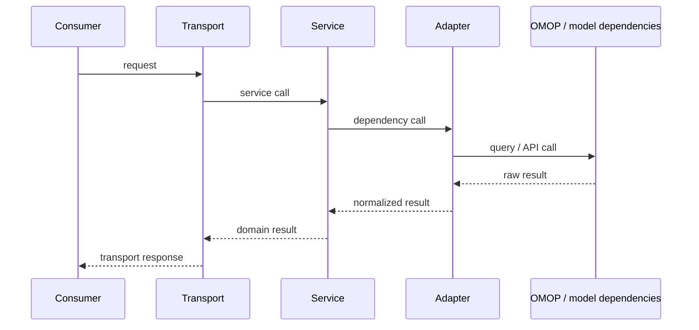

# Integrations

`groundworkers` supports three steady-state integration styles:

1. **MCP** for discoverable tools and shared services
2. **REST** for fixed workflow applications
3. **Direct Python** for in-process orchestration

All three reuse the same runtime config, adapters, and services.

## How to choose

| If you need... | Use... |
|---|---|
| Discoverable tools or a shared remote service | MCP |
| Typed HTTP APIs, OpenAPI, fixed workflow contracts | REST |
| Lowest overhead, batch jobs, library composition inside Python | Direct Python |

## Shared runtime shape



## MCP integration

### Start the service

Local stdio:

```bash
groundworkers
```

Shared HTTP MCP service:

```bash
groundworkers \
  --transport streamable-http \
  --host 0.0.0.0 \
  --port 8000
```

Inspect the active tool surface:

```bash
groundworkers --describe
```

### Example client workflow

Pseudocode:

```python
bundle = mcp_client.call_tool(
    "concept_candidate_bundle",
    {
        "query": "type 2 diabetes",
        "domain": "Condition",
        "include_normalized": True,
        "include_fulltext": True,
        "include_embedding": True,
        "include_standard_mappings": True,
    },
)
```

Representative request payload:

```json
{
  "query": "type 2 diabetes",
  "domain": "Condition",
  "include_normalized": true,
  "include_fulltext": true,
  "include_embedding": true,
  "include_standard_mappings": true,
  "include_hierarchy_context": true
}
```

Representative response shape:

```json
{
  "query": "type 2 diabetes",
  "constraints": {
    "domain": "Condition",
    "vocabulary_id": null,
    "standard_only": false,
    "active_only": true,
    "parent_ids": null
  },
  "channels": {
    "exact": {"available": true, "results": []},
    "normalized": {"available": true, "results": []},
    "fulltext": {"available": true, "results": []},
    "embedding": {"available": true, "results": []}
  },
  "standardized_candidates": [],
  "candidate_union": [],
  "warnings": []
}
```

MCP is useful when the client can work with discoverable tool names and structured
payloads.

## REST integration

### Start the service

```bash
groundworkers \
  --transport rest \
  --host 0.0.0.0 \
  --port 8080
```

Current curated routes:

- `GET /healthz`
- `POST /v1/mapping/candidate-bundle`
- `POST /v1/source-planning/assisted-plan`

### Example: candidate bundle

```bash
curl -X POST http://localhost:8080/v1/mapping/candidate-bundle \
  -H 'content-type: application/json' \
  -d '{
    "query": "type 2 diabetes",
    "domain": "Condition",
    "include_embedding": true,
    "include_standard_mappings": true
  }'
```

### Example: assisted source planning

```bash
curl -X POST http://localhost:8080/v1/source-planning/assisted-plan \
  -H 'content-type: application/json' \
  -d '{
    "content": "field_name,field_label\nhba1c,Haemoglobin A1c\n",
    "filename": "dictionary.csv",
    "caller_hint": "data_dictionary"
  }'
```

REST is curated rather than exhaustive. The REST transport exposes workflow
operations with stable request and response models; it does not attempt to
mirror the full MCP tool surface.

## Direct Python integration

### Build the application once

```python
from groundworkers.app import build_application
from groundworkers.bootstrap import build_app_config

    config = build_app_config(config_path="/path/to/config.toml")
app = build_application(config)

mapping = app.services.mapping
assert mapping is not None
```

### Example: service-backed mapper

```python
class MappingReviewService:
    def __init__(self, mapping_service) -> None:
        self._mapping = mapping_service

    def build_review_packet(self, source_term: str) -> dict:
        bundle = self._mapping.concept_candidate_bundle(
            source_term,
            domain="Condition",
            include_normalized=True,
            include_fulltext=True,
            include_embedding=True,
            include_standard_mappings=True,
            include_hierarchy_context=True,
        )
        top = bundle["candidate_union"][0] if bundle["candidate_union"] else None
        context = None
        if top is not None:
            context = self._mapping.concept_mapping_context(
                top["concept_id"],
                include_standard_mapping=True,
                include_ancestors=True,
                include_relationship_summary=True,
                include_neighbors=True,
            )
        return {
            "source_term": source_term,
            "bundle": bundle,
            "selected_context": context,
        }
```

Direct Python is the best fit when your caller is already Python and you want
the service layer without a transport hop.

For graph-backed direct Python calls, prefer `app.services.graph` and
`app.services.grounding`. For lexical retrieval, use `app.services.vocab`. For
review-oriented orchestration, use `app.services.mapping`.

## Mixing interfaces

It is reasonable to combine interfaces in one deployment:

- use **MCP** for clients that need discoverable tools
- use **REST** for tightly controlled workflow applications
- use **direct Python** for batch evaluation, tests, or internal orchestration

Because all three sit on the same service layer, the important choice is
consumer ergonomics and transport fit, not a different implementation path.
